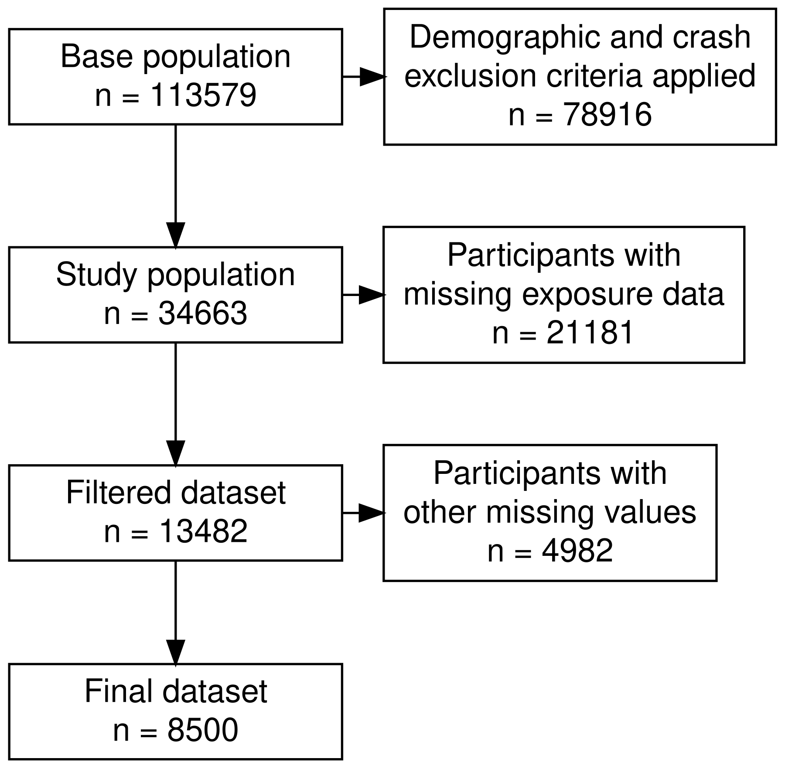
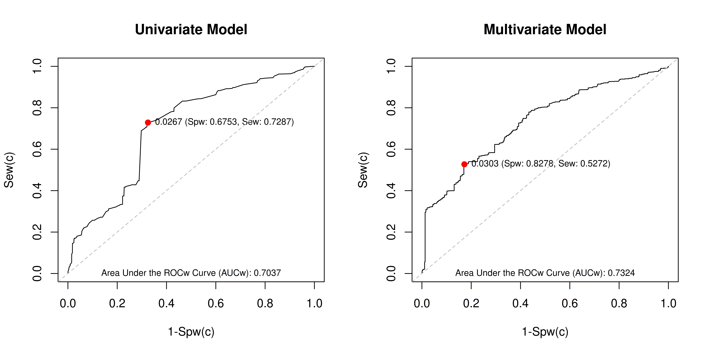

```{r setup, include=FALSE}
# ==== Setup: packages, knit options, data path ==============================
library(tidyverse)   # data manipulation + ggplot2
library(haven)       # read_sas() for raw NASS-CDS files
library(survey)      # svydesign() / svyglm() for complex-survey models
library(car)         # vif() collinearity diagnostics
library(svyROC)      # wroc() / wroc.plot() weighted ROC curves
library(vroom)       # fast read/write of cached .csv data
library(misty)       # na.test() Little's MCAR test
library(naniar)      # geom_miss_point() missingness visualization
library(gridExtra)   # grid.arrange() multi-panel plots
library(mice)        # multiple imputation
library(kableExtra)  # publication tables
library(knitr)       # kable() + knit options
library(bookdown)    # pdf_document2 output format
library(DiagrammeRsvg) # export_svg() for the flow diagram
library(rsvg)        # rsvg_png() to rasterize the flow diagram
library(khsmisc)     # exclusion_flowchart()

knitr::opts_knit$set(
  root.dir = rprojroot::find_rstudio_root_file(),
  fig.pos = "H"
)
data_path_nhtsa <- file.path("data", "NHTSA_databases", "NHTSA All files")
```

```{r universal variables, include=FALSE}
# ---- Reproduction switches -------------------------------------------------
# These control which expensive build steps re-run when the document is knitted.
# All default to FALSE, so a normal knit loads cached results and renders fast.
# Set a switch to TRUE to regenerate that layer from scratch.
#
#   REBUILD_RAW     re-derive the cached data from the raw NASS-CDS .sas7bdat
#                   and MADYMO output files. Requires those raw inputs (not part
#                   of the cached dataset), so most users leave this FALSE.
#   REBUILD_MODELS  re-fit the stepwise survey models from the cached data.
#                   Needs no raw inputs - set TRUE to reproduce the results.
#   REBUILD_MICE    re-run the multiple-imputation sensitivity analysis. This is
#                   slow, so it is kept as a separate opt-in layer.
REBUILD_RAW    <- FALSE
REBUILD_MODELS <- FALSE
REBUILD_MICE   <- FALSE

# ---- Study constants and helpers -------------------------------------------
min_DV_MPH <- 5
max_DV_MPH <- 40

bmi_cutoff <- 30  # 32 improves sensitivity/specificity but leaves too few cases in the higher-speed strata

# Return the ratio of 1s to 0s for a binary variable.
# Example: binary_ratio(df, df$CONCUSSION)
binary_ratio <- function(df, df_var) {
  df_temp_one <- subset(df, df_var == 1) %>% nrow()
  df_temp_zero <- subset(df, df_var == 0) %>% nrow()
  ratio <- df_temp_one / df_temp_zero
  return(ratio)
}
```

```{r general functions, include=FALSE}
# ==== Shared helper functions ===============================================
# Format a p-value for display: "<0.001" below that threshold, "" for NA,
# otherwise three decimal places. Vectorized, so it works on a single value or
# a column of p-values.
format_p <- function(p) {
  ifelse(is.na(p), "", ifelse(p < 0.001, "<0.001", sprintf("%.3f", p)))
}

# Build the NASS-CDS complex-survey design: PSU clusters nested within PSUSTRAT
# strata, weighted by RATWGT. Used by every survey model in this document.
build_survey_design <- function(data) {
  svydesign(
    ids = ~PSU,
    strata = ~PSUSTRAT,
    weights = ~RATWGT,
    data = data,
    nest = TRUE
  )
}

# Compute exponentiated 95% confidence intervals for a model's coefficients
# and return them as formatted text plus numeric upper/lower bounds.
odds_ratio_ci <- function(model) {
  model_summary <- summary(model)
  df_residual <- model_summary$df.residual  # Residual degrees of freedom
  
  # Extract coefficients and standard errors
  coefs <- coef(model)
  se <- sqrt(diag(vcov(model)))

  # Compute the 95% confidence interval from the t-distribution
  alpha <- 0.05
  t_critical <- qt(1 - alpha/2, df = df_residual)
  ci <- cbind(
    lower = coefs - t_critical * se,
    upper = coefs + t_critical * se
  )


  # Exponentiate the bounds to the odds-ratio scale and drop the intercept row
  metrics_list <- list(
    beta_ci_lower = exp(ci[, 1]),
    beta_ci_upper = exp(ci[, 2])
  ) %>%
    as.data.frame() %>%
    mutate(
      beta_ci_lower = round(beta_ci_lower, 2),
      beta_ci_upper = round(beta_ci_upper, 2)
    ) %>%
    filter(
      row_number() != 1
    )
  
  
  
  ci_text_list <- list(
    ci_text = paste0(
      round(metrics_list$beta_ci_lower, 2), 
      ", ", 
      round(metrics_list$beta_ci_upper, 2)),
    ci_upper = round(metrics_list$beta_ci_upper, 2),
    ci_lower = round(metrics_list$beta_ci_lower, 2)
  )
  
  return(ci_text_list)
}
```

```{r get MADYMO HIC values and build MADYMO dataframe, eval=REBUILD_RAW, include=FALSE}
# ==== Build raw data (REBUILD_RAW): MADYMO + NASS-CDS extraction ====
# Build the data frame of MADYMO simulation conditions
BELTUSE_BIN <- c(0, 1)
BAGDEPLOY_BIN <- c(0, 1)
SEATPOS <- c(11, 13)
madymo_DV_MPH <- 5:65

MADYMO_df <- data.frame()
MADYMO_df <- expand.grid(
  BELTUSE_BIN = BELTUSE_BIN,
  BAGDEPLOY_BIN = BAGDEPLOY_BIN,
  SEATPOS = SEATPOS,
  DV_MPH = madymo_DV_MPH
)

MADYMO_df$BELTUSE_BIN <- as.factor(MADYMO_df$BELTUSE_BIN)
MADYMO_df$BAGDEPLOY_BIN <- as.factor(MADYMO_df$BAGDEPLOY_BIN)
MADYMO_df$SEATPOS <- as.factor(MADYMO_df$SEATPOS)

# Write the MADYMO data frame (without HIC data) to a .csv for reference outside this code
# write.csv(MADYMO_df, file = file.path("data", "MADYMO_df.csv"))

MADYMO_df <- MADYMO_df %>%
  mutate(
    file_path = file.path(
      "data",
      "minimal_simulations",
      paste0(DV_MPH, "_mph"),
      ifelse(SEATPOS == 11, "driver", "pass"),
      ifelse(BELTUSE_BIN == 0, "nobelt", "belt"),
      ifelse(BAGDEPLOY_BIN == 0, "noairbag", "airbag"),
      "madymo",
      "madymo.peak"
    )
  )

MADYMO_df <- MADYMO_df %>%
  mutate(
    HIC15 = NA,
    T1_15 = NA,
    T2_15 = NA,
    HIC36 = NA,
    T1_36 = NA,
    T2_36 = NA,
    PEAK_LACC = NA,
    PEAK_AACC = NA
  )


# Check that all expected MADYMO output files exist
file_exist_errors <- list()
for (i in MADYMO_df$file_path[1:nrow(MADYMO_df)]) {
  if (!file.exists(file.path(i))) {
    file_exist_errors[i] <- i}
}

# Report any missing files
if (length(file_exist_errors) != 0) {
  cat("Files missing:", paste(file_exist_errors, "\n"))
} else {
  cat("No MADYMO files missing")
}

# Track file names that failed to process
error_names <- c()

# Loop through each file in the file_path column of MADYMO_df
for (i in 1:nrow(MADYMO_df)) {
  file_name <- MADYMO_df$file_path[i]
  cat("Processing file:", file_name, "\n")

  # Use tryCatch to handle errors such as missing files
  result <- tryCatch({
    # Step 1: read the file into R
    cat("Attempting to read file:", file_name, "\n")
    lines <- readLines(file_name)

    print(paste("Loading", file_name))

    # Initialize empty variables to hold the extracted values
    HIC15 <- NA
    T1_15 <- NA
    T2_15 <- NA
    HIC36 <- NA
    T1_36 <- NA
    T2_36 <- NA
    PEAK_LACC <- NA
    PEAK_AACC <- NA
    
    cat("Successfully read file:", file_name, "\n")

    # Parse a MADYMO output line and return its VALUE, T1, and T2 numbers.
    extract_hic_values <- function(line) {
      # Extract VALUE
      value <- as.numeric(gsub(".*VALUE[^0-9]*([0-9\\.]+).*", "\\1", line))

      # Extract T1
      t1 <- as.numeric(gsub(".*T1\\s*=\\s*([0-9\\.]+).*", "\\1", line))

      # Extract T2
      t2 <- as.numeric(gsub(".*T2\\s*=\\s*([0-9\\.]+).*", "\\1", line))

      return(list(value = value, t1 = t1, t2 = t2))
    }

    # Extract the maximum resultant acceleration from a "Res. acceleration" line.
    extract_res_acceleration <- function(line) {
      # Capture all numbers on the line, including scientific notation
      matches <- regmatches(line, gregexpr("[+-]?\\d*\\.?\\d+(E[+-]?\\d+)?", line))

      # Take the maximum resultant acceleration from the matched numbers
      if (length(matches[[1]]) >= 3) {
        res_acc <- as.numeric(matches[[1]][4])  # The third number
      } else {
        res_acc <- NA
      }

      return(res_acc)
    }

    # Step 2: loop through the lines to find the relevant values
    for (j in 1:(length(lines) - 2)) {

      # Check for the HIC15_inj line
      if (grepl("HIC15_inj", lines[j])) {
        # Extract VALUE, T1, and T2 from two lines down
        value_line <- lines[j + 2]
        
        values_15 <- extract_hic_values(value_line)
        HIC15 <- values_15$value
        T1_15 <- values_15$t1
        T2_15 <- values_15$t2
      }
      
      # Check for the HIC36_inj line
      if (grepl("HIC36_inj", lines[j])) {
        # Extract VALUE, T1, and T2 from two lines down
        value_line <- lines[j + 2]
        
        values_36 <- extract_hic_values(value_line)
        HIC36 <- values_36$value
        T1_36 <- values_36$t1
        T2_36 <- values_36$t2
      }
      
      # Check for the /HumanMale50%/HeadCG_acc identifier line
      if (grepl("/HumanMale50%/HeadCG_acc", lines[j])) {
        cat("Found /HumanMale50%/HeadCG_acc at line", j, "\n")

        # Look for the "Res. acceleration" line nearby
        for (k in (j+1):(j+5)) {  # Check the next 5 lines for the "Res. acceleration" line
          if (grepl("Res. acceleration", lines[k])) {
            cat("Found Res. acceleration at line", k, "\n")

            # Extract the maximum resultant acceleration
            PEAK_LACC <- extract_res_acceleration(lines[k])
            cat("Extracted max resultant acceleration (m/s/s) (PEAK_LACC):", PEAK_LACC, "\n")
            break
          }
        }
      }
      
      # Check for the /HumanMale50%/Head_aac identifier line
      if (grepl("/HumanMale50%/Head_aac", lines[j])) {
        cat("Found /HumanMale50%/Head_aac at line", j, "\n")

        # Look for the "Res. ang. acc." line nearby
        for (k in (j+1):(j+5)) {  # Check the next 5 lines for the "Res. ang. acc." line
          if (grepl("Res. ang. acc.", lines[k])) {
            cat("Found Res. ang. acc. at line", k, "\n")
            
            # Extract the maximum resultant acceleration
            PEAK_AACC <- extract_res_acceleration(lines[k])
            cat("Extracted max resultant acceleration (PEAK_AACC):", PEAK_AACC, "\n")
            break
          }
        }
      }
    }
    
    # Step 3: assign the extracted values to the matching row of MADYMO_df
    MADYMO_df$HIC15[i] <- HIC15
    MADYMO_df$T1_15[i] <- T1_15
    MADYMO_df$T2_15[i] <- T2_15
    MADYMO_df$HIC36[i] <- HIC36
    MADYMO_df$T1_36[i] <- T1_36
    MADYMO_df$T2_36[i] <- T2_36
    MADYMO_df$PEAK_LACC[i] <- PEAK_LACC
    MADYMO_df$PEAK_AACC[i] <- PEAK_AACC

    TRUE  # Indicate success
  }, error = function(e) {
    # Record the file name on failure
    cat("Error in processing file:", file_name, "\n")
    error_names <<- c(error_names, file_name)
    FALSE  # Indicate failure
  })

  # Log whether the file was processed
  if (result) {
    cat("File processed successfully:", file_name, "\n")
  } else {
    cat("Skipping file due to error:", file_name, "\n")
  }
}

# Convert linear acceleration to g
MADYMO_df$PEAK_LACC_g <- MADYMO_df$PEAK_LACC / 9.81

# Report any files that caused errors
if (length(error_names) > 0) {
  cat(length(error_names), " Files with errors:", paste(error_names, collapse = ", "), "\n")
} else {
  cat("No errors occurred during processing.\n")
}

MADYMO_df$SEATPOS <- as.factor(MADYMO_df$SEATPOS)
MADYMO_df$BELTUSE_BIN <- as.factor(MADYMO_df$BELTUSE_BIN)
MADYMO_df$BAGDEPLOY_BIN <- as.factor(MADYMO_df$BAGDEPLOY_BIN)

# Write MADYMO_df to a cached .csv with vroom
vroom::vroom_write(MADYMO_df, file = file.path("data", "MADYMO_df.csv"))


```

```{r create nhtsa dataframe 2000-2015, eval=REBUILD_RAW, include=FALSE}
# Running totals across all processed years
vehicle_count <- 0
individual_count <- 0

# Load and merge one year of NASS-CDS files into a single occupant-level data
# frame, deriving the injury and exposure variables used downstream.
process_year <- function(year) {
  # Load datasets (adjust paths as necessary)
  # Occupant injury
  oi <- read_sas(file.path(data_path_nhtsa, paste0(year, "oi.sas7bdat")))
  # Occupant
  oa <- read_sas(file.path(data_path_nhtsa, paste0(year, "oa.sas7bdat")))
  # General vehicle
  gv <- read_sas(file.path(data_path_nhtsa, paste0(year, "gv.sas7bdat")))
  # Vehicle event
  ve <- read_sas(file.path(data_path_nhtsa, paste0(year, "ve.sas7bdat")))
  # Accident
  accident <- read_sas(file.path(data_path_nhtsa, paste0(year, "accident.sas7bdat")))
  
  print(paste("Year:", year))
  
  
  if (year == 2005) {
    oi <- oi %>% select(-RATWGT_U)
    oa <- oa %>% select(-RATWGT_U)
    gv <- gv %>% select(-RATWGT_U)
    ve <- ve %>% select(-RATWGT_U)
    accident <- accident %>% select(-RATWGT_U)
  }
  
  # Process injuries
  injury_temp <- oi %>%
    mutate(
      # Handle column-name inconsistencies across years
      BODYREG = if ("BODYREG" %in% names(.)) BODYREG else bodyreg,
      LESION = if ("LESION" %in% names(.)) LESION else lesion
    ) %>%
    mutate(
      BACK = ifelse(BODYREG == "B", 1, 0),
      NECK = ifelse(BODYREG == "N", 1, 0),
      # Flag concussion using AIS 93 coding translated to AIS 85 coding
      CONCUSSION = ifelse(LESION == "K", 1, 0),
      HEADINJ = ifelse(BODYREG == "H", 1, 0),
      AIS1 = ifelse(AIS >= 1 & AIS <= 6, 1, 0)
    )
  
  
  
  
  
  
  print(paste("all injuries count:", nrow(injury_temp)))
  ifelse(year == 2000, print(colnames(injury_temp)), print(""))
  
  # Summarize injuries to one row per occupant
  injury_summary <- injury_temp %>%
    group_by(PSU, CASENO, VEHNO, OCCNO, RATWGT) %>%
    summarise(
      BACK = max(BACK, na.rm = TRUE),
      NECK = max(NECK, na.rm = TRUE),
      CONCUSSION = max(CONCUSSION, na.rm = TRUE),
      HEADINJ = max(HEADINJ, na.rm = TRUE),
      AIS1 = max(AIS1, na.rm = TRUE),
      .groups = "drop"
    ) %>%
    # Replace -Inf with NA (produced by max(na.rm = TRUE) when all values are NA)
    mutate(across(everything(), ~ ifelse(is.infinite(.), NA, .)))
  
  print(
    paste(
      "all injured individuals count:", 
      nrow(
        injury_summary)))
  
  
  # Start with occupant data (oa) and left-join the injury summary
  occ <- oa %>%
    # Merge injury data, retaining all occupants even if uninjured
    left_join(injury_summary, by = c("PSU", "CASENO", "VEHNO", "OCCNO", "RATWGT")) %>%
    # Replace NA with 0 in the injury columns (uninjured occupants)
    mutate(
      across(c(BACK, NECK, CONCUSSION, HEADINJ, AIS1), ~ replace_na(., 0)),
      OI = ifelse(BACK == 1 | NECK == 1 | CONCUSSION == 1 | HEADINJ == 1 | AIS1 == 1, 1, 0),
      BELTUSE_BIN = ifelse(MANUSE %in% c(0, 1), 0, ifelse(MANUSE == 4, 1, NA)),
      BAGDEPLOY_BIN = ifelse(BAGDEPLY == 1, 1, 0),
      BMI = WEIGHT / ((HEIGHT / 100) ^ 2),
      BMI_HIGH = ifelse(BMI >= 30, 1, 0)
    )
  ifelse(year == 2000, print(colnames(occ)), print(""))
  
  
  # Count all individuals involved in all crashes across all years
  oa_grouped <- oa %>%
    group_by(PSU, CASENO, OCCNO, RATWGT)
  individual_count <<- individual_count + nrow(oa_grouped)
  
  
  
  
  print(paste("injured + uninjured count:", nrow(occ)))
  
  
  
  # Build vehicle-level data
  veh <- gv %>%
    inner_join(ve, by = c("PSU", "CASENO", "VEHNO", "RATWGT", "VERSION", "STRATIF", "CASEID")) %>%
    mutate(
      DV_MPH = round(DVTOTAL * 0.621371)
    )


  # Count all vehicles involved in all crashes across all years
  vehicle_count <<- vehicle_count + nrow(gv)
  ifelse(year == 2000, print(colnames(veh)), print(""))


  print(paste("gv + veh count:", nrow(veh)))

  # Join occupants to vehicles
  veh_temp <- occ %>%
    inner_join(veh, by = c("PSU", "CASENO", "VEHNO", "RATWGT", "VERSION", "STRATIF", "CASEID"))

  print(paste("veh + occ count:", nrow(veh_temp)))

  # Join in the accident-level data
  front <- veh_temp %>%
    inner_join(accident, by = c("PSU", "CASENO", "RATWGT", "CASEID", "STRATIF", "VERSION"))
  ifelse(year == 2000, print(colnames(front)), print(""))
  
  
  print(paste("accident + front count:", nrow(front)))
  
  print(
    ifelse(
      "RATWGT_U" %in% colnames(front),
      "RATWGT_U exists",
      "no RATWGT_U"
    )
  )
  
  return(front)
}

# Process every year and combine into one data frame
years <- 2000:2015
# years <- 2000
all_data_cds <- lapply(years, process_year)
nhtsa_combined_df_cds <- bind_rows(all_data_cds)

# Write the combined data frame to a cached .csv with vroom
vroom::vroom_write(nhtsa_combined_df_cds, file = file.path("data", "nhtsa_combined_df_saved_cds.csv"))
```

```{r load nhtsa df, include=FALSE}
# ==== Load and clean data ====
# Read the cached combined NASS-CDS data frame with vroom
nhtsa_combined_df_cds <- vroom::vroom(file.path("data", "nhtsa_combined_df_saved_cds.csv"))
```

```{r clean and filter nhtsa dataframes, include=FALSE}
# Apply final variable adjustments
nhtsa_combined_df_cds <- nhtsa_combined_df_cds %>%
  mutate(
    BACK = ifelse(BACK < 1, 0, BACK),
    NECK = ifelse(NECK < 1, 0, NECK),
    CONCUSSION = as.factor(ifelse(CONCUSSION < 1, 0, CONCUSSION)),
    HEADINJ = as.factor(ifelse(HEADINJ < 1, 0, HEADINJ)),
    AIS1 = ifelse(AIS1 < 1, 0, AIS1),
    OI = ifelse(OI < 1, 0, OI),
    # Confirm this captures the intended group
    INJURED = ifelse(OI == 1 | MAIS > 0 | INJNUM > 0, 1, 0),
    SEX_BIN = ifelse(SEX == 1, "m", ifelse(SEX == 9, NA, "f")),
    # Combine WEATHER and CLIMATE; they measure the same thing but were coded
    # differently across years
    WEATHER = ifelse(
      YEAR %in% c(2000:2006),
      WEATHER,
      ifelse(
        YEAR %in% c(2007:2015),
        CLIMATE,
        NA
      )
    ),
    # WEATHER code mapping (NASS-CDS WEATHER and CLIMATE fields)
    #     name           WEATHER  CLIMATE
    # no adverse conditions   0   18, 19 (cloudy)
    # rain                    1   12
    # sleet/hail              2   13 or 21
    # snow                    3   14 or 15
    # fog                     4   11
    # rain and fog            5
    # sleet and fog           6
    # other                   7   98
    # unknown                 .U  .U
    WEATHER = ifelse(
      WEATHER %in% c(18, 19), 0,
      ifelse(
        WEATHER == 12, 1,
        ifelse(
          WEATHER %in% c(13, 20, 21), 2,
          ifelse(
            WEATHER == 14 | WEATHER == 15, 3,
            ifelse(
              WEATHER %in% c(98, 16), 7,
              ifelse(
                WEATHER == 11, 4,
                WEATHER
              )))))),
    DVEST_KPH = 
      ifelse(
        DVEST == 0, DVTOTAL,
        ifelse(
          DVEST == 1, 5,
          ifelse(
            DVEST == 2, 17,
            ifelse(
              DVEST == 3, 32,
              ifelse(
                DVEST == 4, 47,
                ifelse(
                  DVEST == 5, 62, NA
                )))))),
    DV_MPH =
      ifelse(DV_MPH == 621, NA, DV_MPH),
    DVEST_MPH = round(DVEST_KPH * 0.621371, digits = 0),
    BMI = round(BMI, digits = 0)
  )


data_counts <- list()
criteria_list <- list()

data_counts <- c(
  data_counts,
  before_AGE = nrow(nhtsa_combined_df_cds)
)
criteria_list <- c(
  criteria_list,
  before_AGE = paste0(
    "Count before any filters: ", 
    data_counts$before_AGE)
)

# Apply the inclusion and exclusion criteria
nhtsa_combined_df_cds <- nhtsa_combined_df_cds %>%
  filter(
    AGE >= 20,
    AGE < 999
  )

data_counts <- c(
  data_counts,
  before_seatpos = nrow(nhtsa_combined_df_cds)
)

criteria_list <- c(
  criteria_list,
  before_seatpos = paste0(
    "Count after AGE >= 20: ", 
    data_counts$before_seatpos)
)

nhtsa_combined_df_cds <- nhtsa_combined_df_cds %>%
  filter(
    SEATPOS %in% c(11, 13)
  )

data_counts <- c(
  data_counts,
  before_events = nrow(nhtsa_combined_df_cds)
)

criteria_list <- c(
  criteria_list,
  before_events = paste0(
    "Count after SEATPOS %in% c(11, 13): ", 
    data_counts$before_events)
)

nhtsa_combined_df_cds <- nhtsa_combined_df_cds %>%
  filter(
    # Single impact event
    EVENTS == 1)

data_counts <- c(
  data_counts,
  before_DOF1 = nrow(nhtsa_combined_df_cds)
)

criteria_list <- c(
  criteria_list,
  before_DOF1 = paste0(
    "Count after EVENTS == 1: ", 
    data_counts$before_DOF1)
)
# print(
#   criteria_list$before_DOF1
#   )

nhtsa_combined_df_cds <- nhtsa_combined_df_cds %>%
  filter(
    DOF1 %in% c(1, 11, 12, 21, 31, 32, 41, 51, 52, 61, 71, 72, 81, 91, 92)
  )

# DVEST is in kph and categorized, but has fewer NAs than DVTOTAL.

data_counts <- c(
  data_counts,
  before_DVEST = nrow(nhtsa_combined_df_cds)
)

criteria_list <- c(
  criteria_list,
  before_DVEST_MPH = paste0(
    "Count after DOF1 %in% c(1, 11, 12, 21, 31, 32, 41, 51, 52, 61, 71, 72, 81, 91, 92): ", 
    data_counts$before_DVEST)
)

nhtsa_combined_df_cds <- nhtsa_combined_df_cds %>%
  filter(
    DVEST_MPH >= min_DV_MPH & DVEST_MPH <= max_DV_MPH
  )

data_counts <- c(
  data_counts,
  before_BELTUSE_BIN = nrow(nhtsa_combined_df_cds)
)

criteria_list <- c(
  criteria_list,
  before_BELTUSE_BIN = paste0(
    "Count after DVEST_MPH >= ", min_DV_MPH, " & DVEST_MPH <= ", max_DV_MPH, ": ", 
    data_counts$before_BELTUSE_BIN)
)

nhtsa_combined_df_cds <- nhtsa_combined_df_cds %>%
  filter(
    !is.na(BELTUSE_BIN)
  )

data_counts <- c(
  data_counts,
  before_BAGDEPLOY_BIN = nrow(nhtsa_combined_df_cds)
)

criteria_list <- c(
  criteria_list,
  before_BAGDEPLOY_BIN = paste0(
    "Count after !is.na(BELTUSE_BIN): ", 
    data_counts$before_BAGDEPLOY_BIN)
)

nhtsa_combined_df_cds <- nhtsa_combined_df_cds %>%
  filter(
    !is.na(BAGDEPLOY_BIN)
  )

data_counts <- c(
  data_counts,
  before_CONCUSSION = nrow(nhtsa_combined_df_cds)
)

criteria_list <- c(
  criteria_list,
  before_CONCUSSION = paste0(
    "Count after !is.na(BAGDEPLOY_BIN): ", 
    data_counts$before_CONCUSSION)
)

nhtsa_combined_df_cds <- nhtsa_combined_df_cds %>%
  filter(
    !is.na(CONCUSSION)
  )

data_counts <- c(
  data_counts,
  after_filters = nrow(nhtsa_combined_df_cds)
)

criteria_list <- c(
  criteria_list,
  after_filters = paste0(
    "FINAL COUNT after !is.na(CONCUSSION):", 
    data_counts$after_filters)
)


nhtsa_combined_df_cds <- nhtsa_combined_df_cds %>%
  select(order(colnames(nhtsa_combined_df_cds)))

# Add a unique ID for each row
nhtsa_combined_df_cds <- nhtsa_combined_df_cds %>%
  mutate(
    ID = row_number()
  )


# Convert the appropriate variables to factors
cols_all <- sort(colnames(nhtsa_combined_df_cds))
cols_factor <- c("BAGDEPLY", "BAGDEPLOY_BIN", "BELTUSE_BIN", "BMI_HIGH", "CONCUSSION", "HEADINJ", "DVEST", "ID", "INJURED", "MAIS", "OCCNO", "OI", "PSU", "PSUSTRAT", "ROLLOVER", "SEATPOS", "SEX_BIN", "VEHNO", "VEHTYPE", "YEAR", "ALCINV", "DEATH", "DRGINV", "MAKE", "WEATHER")
nhtsa_combined_df_cds[cols_factor] <- lapply(nhtsa_combined_df_cds[cols_factor], factor)

cols_explore <- c(cols_factor, "AGE", "BMI", "DV_MPH", "DVEST", "DVEST_MPH", "DVBASIS")

# explore_df <- subset(nhtsa_combined_df_cds, select = cols_explore)
# explore_df$DVBASIS <- as.factor(explore_df$DVBASIS)
# Add an IND_ID variable as a unique identifier for each individual

# Print the inclusion and exclusion counts
print(paste(criteria_list))

# Save criteria_list to disk
save(criteria_list, file = file.path("data", "criteria_list.RData"))
```

```{r join MADYMO data, include=FALSE}
# Read MADYMO_df.csv with vroom
MADYMO_df <- vroom::vroom(file.path("data", "MADYMO_df.csv"))

# Coerce the join keys to their correct data types
MADYMO_df$SEATPOS <- as.factor(MADYMO_df$SEATPOS)
MADYMO_df$BELTUSE_BIN <- as.factor(MADYMO_df$BELTUSE_BIN)
MADYMO_df$BAGDEPLOY_BIN <- as.factor(MADYMO_df$BAGDEPLOY_BIN)

# Join the MADYMO data onto the NHTSA data frame.
# Speed (DV_MPH, in mph) and the three simulation factors share names across
# both tables, so each key matches on equal column names.
madymo_nhtsa_df <- nhtsa_combined_df_cds %>%
  left_join(MADYMO_df, by = join_by(DV_MPH, SEATPOS, BELTUSE_BIN, BAGDEPLOY_BIN))


# Drop environment objects that are no longer needed
rm(
  MADYMO_df,
  nhtsa_combined_df_cds
)
```

```{r vars into strings and define levels, include=FALSE}
# Replace weather codes with labels
madymo_nhtsa_df$WEATHER <- as.character(madymo_nhtsa_df$WEATHER)
madymo_nhtsa_df$WEATHER[madymo_nhtsa_df$WEATHER == 0] <- "no adverse conditions"
madymo_nhtsa_df$WEATHER[madymo_nhtsa_df$WEATHER == 1] <- "rain"
madymo_nhtsa_df$WEATHER[madymo_nhtsa_df$WEATHER %in% c(2, 4, 5, 6)] <- "sleet/hail/fog"
madymo_nhtsa_df$WEATHER[madymo_nhtsa_df$WEATHER == 3] <- "snow"
madymo_nhtsa_df$WEATHER[madymo_nhtsa_df$WEATHER == 7] <- "other"
madymo_nhtsa_df$WEATHER[madymo_nhtsa_df$WEATHER == 8] <- "unknown"
# Collapse rain, snow, and sleet/hail/fog into "snow/rain/fog"
madymo_nhtsa_df$WEATHER[madymo_nhtsa_df$WEATHER %in% c("rain", "snow", "sleet/hail/fog")] <- "snow/rain/fog"
# Collapse other and unknown
madymo_nhtsa_df$WEATHER[madymo_nhtsa_df$WEATHER %in% c("other", "unknown")] <- "other"

# Drop all "other" weather observations
madymo_nhtsa_df <- madymo_nhtsa_df %>%
  filter(WEATHER != "other")

# Set "no adverse conditions" as the reference level
madymo_nhtsa_df$WEATHER <- factor(
  madymo_nhtsa_df$WEATHER, 
  levels = c(
    "no adverse conditions", "snow/rain/fog"
  )
)

# Add a continuous YEAR variable
madymo_nhtsa_df$YEAR_cont <- as.numeric(madymo_nhtsa_df$YEAR) + 1999

# Replace vehicle-type codes with labels
madymo_nhtsa_df$VEHTYPE <- as.character(madymo_nhtsa_df$VEHTYPE)
madymo_nhtsa_df$VEHTYPE[madymo_nhtsa_df$VEHTYPE == "P"] <- "passenger vehicle"
madymo_nhtsa_df$VEHTYPE[madymo_nhtsa_df$VEHTYPE == "T"] <- "truck"
madymo_nhtsa_df$VEHTYPE[madymo_nhtsa_df$VEHTYPE %in% c(
  "U", 9, "BUS", "INCOMPLETE VEHICLE"
)] <- "unknown/other"

# Drop all "unknown/other" vehicle-type observations
madymo_nhtsa_df <- madymo_nhtsa_df %>%
  filter(VEHTYPE != "unknown/other")

# Set passenger vehicle as the reference level
madymo_nhtsa_df$VEHTYPE <- factor(
  madymo_nhtsa_df$VEHTYPE, 
  levels = c(
    "passenger vehicle", "truck"
  )
)


# Convert ALCINV codes to labels
madymo_nhtsa_df$ALCINV <- as.character(madymo_nhtsa_df$ALCINV)
madymo_nhtsa_df$ALCINV[madymo_nhtsa_df$ALCINV == 1] <- "yes"
madymo_nhtsa_df$ALCINV[madymo_nhtsa_df$ALCINV == 2] <- "no"
madymo_nhtsa_df$ALCINV[madymo_nhtsa_df$ALCINV == 9] <- "unknown"


# Convert DRGINV codes to labels
madymo_nhtsa_df$DRGINV <- as.character(madymo_nhtsa_df$DRGINV)
madymo_nhtsa_df$DRGINV[madymo_nhtsa_df$DRGINV == 1] <- "yes"
madymo_nhtsa_df$DRGINV[madymo_nhtsa_df$DRGINV == 2] <- "no"
madymo_nhtsa_df$DRGINV[madymo_nhtsa_df$DRGINV == 9] <- "unknown"

# Convert SEATPOS codes to labels
madymo_nhtsa_df$SEATPOS <- as.character(madymo_nhtsa_df$SEATPOS)
madymo_nhtsa_df$SEATPOS[madymo_nhtsa_df$SEATPOS == 11] <- "driver"
madymo_nhtsa_df$SEATPOS[madymo_nhtsa_df$SEATPOS == 13] <- "passenger"

# Convert belt use to yes/no
madymo_nhtsa_df$BELTUSE_BIN <- as.character(madymo_nhtsa_df$BELTUSE_BIN)
madymo_nhtsa_df$BELTUSE_BIN[madymo_nhtsa_df$BELTUSE_BIN == 0] <- "no"
madymo_nhtsa_df$BELTUSE_BIN[madymo_nhtsa_df$BELTUSE_BIN == 1] <- "yes"

# Convert airbag deployment to yes/no
madymo_nhtsa_df$BAGDEPLOY_BIN <- as.character(madymo_nhtsa_df$BAGDEPLOY_BIN)
madymo_nhtsa_df$BAGDEPLOY_BIN[madymo_nhtsa_df$BAGDEPLOY_BIN == 0] <- "no"
madymo_nhtsa_df$BAGDEPLOY_BIN[madymo_nhtsa_df$BAGDEPLOY_BIN == 1] <- "yes"

# Convert sex codes to labels
madymo_nhtsa_df$SEX_BIN <- as.character(madymo_nhtsa_df$SEX_BIN)
madymo_nhtsa_df$SEX_BIN[madymo_nhtsa_df$SEX_BIN == "m"] <- "male"
madymo_nhtsa_df$SEX_BIN[madymo_nhtsa_df$SEX_BIN == "f"] <- "female"


# Bin time of day into categories
madymo_nhtsa_df <- madymo_nhtsa_df %>%
  mutate(
    TIME_cat = cut(
      TIME,
      breaks = c(0, 600, 1200, 1800, 2400),
      labels = c("night", "morning", "afternoon", "evening"),
      include.lowest = TRUE
    )
  )

# Order the TIME_cat factor levels (morning, afternoon, evening, night)
madymo_nhtsa_df$TIME_cat <- factor(
  madymo_nhtsa_df$TIME_cat,
  levels = c("morning", "afternoon", "evening", "night")
)


madymo_nhtsa_df$TIME_cat_bin <- ifelse(
    madymo_nhtsa_df$TIME_cat %in% c("morning", "afternoon"),
    "day",
    "night"
)
```

```{r define kept columns, include=FALSE}
columns_final <- c("ID", "CONCUSSION", "BAGDEPLOY_BIN", "BELTUSE_BIN", "BMI", "HEIGHT", "WEIGHT", "SEATPOS", "SEX_BIN", "YEAR", "AGE", "DV_MPH", "DVEST_MPH", "PSU", "PSUSTRAT", "RATWGT", "ALCINV", "DRGINV", "MAKE", "MODELYR", "WEATHER", "TIME", "TIME_cat", "TIME_cat_bin", "VEHTYPE", "HIC15", "YEAR_cont")

# Keep only the relevant columns
madymo_nhtsa_df <- madymo_nhtsa_df %>%
  select(
    all_of(columns_final))
```

```{r extreme values, include=FALSE}
# Preserve madymo_nhtsa_df before removing extreme values
madymo_nhtsa_df_full <- madymo_nhtsa_df
# Examine extreme values
extreme_values <- madymo_nhtsa_df %>%
  select_if(is.numeric) %>%
  gather(variable, value) %>%
  group_by(variable) %>%
  summarise(
    min = min(value, na.rm = TRUE),
    max = max(value, na.rm = TRUE)
  ) %>%
  arrange(desc(abs(min)), desc(abs(max)))

# Inspect the extreme values
print(extreme_values, n = 23)

# Collect IDs whose values should be omitted
extreme_value_ids <- c()


# MODELYR values are all reasonable. All MADYMO measurements come from
# simulation and are not subject to data-entry error. WEIGHT and HEIGHT were
# imperial (pounds and inches) before 1993, but that does not affect this
# dataset; WEIGHT is capped at 150 and HEIGHT at 220, with larger values
# collapsed into those maxima.


# Investigate BMI rather than HEIGHT and WEIGHT separately, which surfaces unusual values
bmi_df <- madymo_nhtsa_df %>%
  filter(BMI < 10 | BMI > 70) %>%
  select(ID, YEAR, BMI, HEIGHT, WEIGHT, AGE)
# ID 858 has BMI 1.73 (height 170 cm, weight 5 kg, age 39); likely a data-entry error, so omit
extreme_value_ids <- c(
  extreme_value_ids,
  858
)
# IDs 1902 and 9191 have BMI 5.7 and 7.4 (heights 157, 168; weights 14, 21; ages 34, 47); status uncertain
extreme_value_ids <- c(
  extreme_value_ids,
  1902, 9191
)
# Except for ID 7553, all heights with BMI > 100 appear to be entered in inches (40 to 75); recode these
# Recode HEIGHT from inches to cm for IDs where BMI > 101 and HEIGHT < 75
extreme_values_df <- madymo_nhtsa_df %>%
  filter(BMI > 101 & HEIGHT < 75) %>%
  mutate(HEIGHT = HEIGHT * 2.54) %>%
  select(ID, HEIGHT)
# Copy the recoded values back into madymo_nhtsa_df
madymo_nhtsa_df <- madymo_nhtsa_df %>%
  rows_update(extreme_values_df, by = "ID") %>%
  # Recalculate BMI from the corrected HEIGHT values
  mutate(BMI = round(WEIGHT / ((HEIGHT / 100) ^ 2)))

# Drop HEIGHT and WEIGHT now that BMI is based on the corrected values
madymo_nhtsa_df <- madymo_nhtsa_df %>%
  select(-HEIGHT, -WEIGHT)


# TIME values are all within the expected range of 0001 to 2400

# Investigate AGE with a histogram
ggplot(madymo_nhtsa_df, aes(x = AGE)) +
  geom_histogram(binwidth = 1) +
  labs(title = "Histogram of AGE", x = "AGE", y = "Count") +
  theme_minimal()
# All values fall within 0 and 97 (the maximum)

# Exclude the flagged extreme-value IDs
madymo_nhtsa_df <- madymo_nhtsa_df %>%
  filter(!ID %in% extreme_value_ids)


# Drop environment objects that are no longer needed
rm(
  extreme_value_ids,
  extreme_values_df,
  extreme_values,
  bmi_df
)
```

```{r functions for survey model evaluation, include=FALSE}
# ==== Survey model-evaluation functions ====
# Plot a weighted ROC curve (with AUC and optimal cut-off) from a fitted survey model.
roc_plot <- function(model_obj, title = "ROC Curve", x_lab ="1-Spw(c)", y_lab = "Sew(c)",
                     print.auc = TRUE, print.cutoff = TRUE, col.cutoff = "red", 
                     cex.text = 0.75, round.digits = 4) {
  x <- model_obj$mycurve
  if (!inherits(x, "wroc")) {
    stop("Please, insert an object of class 'wroc', obtained using the function wroc().")
  }
  if (print.cutoff == TRUE & is.null(x[["optimal.cutoff"]])) {
    cat("The optimal cut-off point cannot be printed given that this information has not saved in the object 'x'.")
  }
  spw.v <- x[["wroc.curve"]][["Spw.values"]]
  sew.v <- x[["wroc.curve"]][["Sew.values"]]
  inv.spw.v <- 1 - spw.v
  plot.df <- data.frame(sew.v, inv.spw.v)
  plot(x = plot.df$inv.spw.v, y = plot.df$sew.v, type = "l", 
       xlab = x_lab, ylab = y_lab, main = title)
  if (print.auc) {
    graphics::text(x = 0.5, y = 0, cex = cex.text, labels = paste0("Area Under the ROCw Curve (AUCw): ", 
                                                                   round(x[["wauc"]], digits = round.digits)))
  }
  if (print.cutoff == TRUE & !is.null(x[["optimal.cutoff"]])) {
    graphics::points(x = 1 - x[["optimal.cutoff"]][["Spw"]], 
                     y = x[["optimal.cutoff"]][["Sew"]], col = col.cutoff, 
                     pch = 19)
    graphics::text(x = 1 - x[["optimal.cutoff"]][["Spw"]], 
                   y = x[["optimal.cutoff"]][["Sew"]], pos = 4, cex = cex.text, 
                   labels = paste0(round(x[["optimal.cutoff"]][["cutoff.value"]], 
                                         digits = round.digits), " (Spw: ", round(x[["optimal.cutoff"]][["Spw"]], 
                                                                                  digits = round.digits), ", Sew: ", round(x[["optimal.cutoff"]][["Sew"]], 
                                                                                                                           digits = round.digits), ")"))
  }
  graphics::abline(a = 0, b = 1, lty = 2, col = "gray")
}


# Fit a survey logistic model and return the weighted ROC curve, performance
# metrics, and the fitted model object.
evaluate_model <- function(formula = "CONCUSSION ~ HIC15", data = madymo_nhtsa_df_listwise_cds, family = quasibinomial) {
  # Build the survey design from the data
  design <- build_survey_design(data)
  
  model <- svyglm(
    as.formula(formula),
    design = design,
    family = family
  )
  
  roc_data <- data.frame(
    y = design$variables$CONCUSSION,
    phat = fitted(model),
    weights = design$variables$RATWGT
  )
  
  
  # Create the weighted ROC object
  invisible(mycurve <- wroc(
    response.var = "y",
    phat.var = "phat",
    weights.var = "weights",
    data = roc_data,
    tag.event = levels(roc_data$y)[2],
    tag.nonevent = levels(roc_data$y)[1],
    cutoff.method = "Youden"
  ))
  
  # Calculate prevalence of the event
  event_level <- levels(roc_data$y)[2]
  prevalence <- sum(roc_data$weights[roc_data$y == event_level]) / sum(roc_data$weights)
  
  
  # Compute the 95% confidence interval from the model
  # Pull the summary to access the residual degrees of freedom
  model_summary <- summary(model)
  df_residual <- model_summary$df.residual  # Residual degrees of freedom

  # Extract coefficients and standard errors
  coefs <- coef(model)
  se <- sqrt(diag(vcov(model)))

  # Compute the 95% confidence interval from the t-distribution
  alpha <- 0.05
  t_critical <- qt(1 - alpha/2, df = df_residual)
  ci <- cbind(
    lower = coefs - t_critical * se,
    upper = coefs + t_critical * se
  )
  
  
  # Extract performance metrics
  metrics_list <- list(
    AUC = mycurve$wauc,
    Optimal_Cutoff = mycurve$optimal.cutoff$cutoff.value,
    Sensitivity = mycurve$optimal.cutoff$Sew,
    Specificity = mycurve$optimal.cutoff$Spw,
    Correlation = cor(as.numeric(roc_data$y), roc_data$phat, use = "pairwise.complete.obs"),
    # Extract the p-value and standard error for the model (HIC15 only)
    beta = summary(model)$coefficients[2, 1],
    beta_ci_lower = ci[2, 1],
    beta_ci_upper = ci[2, 2],
    p_value = summary(model)$coefficients[2, 4],
    se = summary(model)$coefficients[2, 2],
    Cases = mycurve$basics$n.event,
    Controls = mycurve$basics$n.nonevent
    # PPV omitted because low prevalence makes it uninformative
    # PPV = 100 * ((mycurve$optimal.cutoff$Sew * prevalence) / 
    #                ((mycurve$optimal.cutoff$Sew * prevalence) + 
    #                   ((1 - mycurve$optimal.cutoff$Spw) * (1 - prevalence))))
  )
  
  # Generate the ROC plot
  roc_plot_viz <- roc_plot(
    list(mycurve = mycurve),
    title = paste("ROC Curve for", formula))
  
  # Return both plot and metrics
  return(list(
    mycurve = mycurve,
    # roc_plot = roc_plot,
    metrics = metrics_list,
    model = model
  ))
}


# Assemble a comparison table of AUC, sensitivity, specificity, and the scaled
# HIC15 odds ratio across a set of evaluated models.
compare_models <- function(models, multiplier = 1) {
    comparison_df <- data.frame()
    for (model in models) {
      auc        <- get(model)$metrics$AUC
      sensitivity <- get(model)$metrics$Sensitivity
      specificity <- get(model)$metrics$Specificity
      num_cases  <- get(model)$metrics$Cases
      num_controls <- get(model)$metrics$Controls
      p_value    <- get(model)$metrics$p_value
      se         <- get(model)$metrics$se
      beta       <- get(model)$metrics$beta
      beta_ci_lower <- get(model)$metrics$beta_ci_lower
      beta_ci_upper <- get(model)$metrics$beta_ci_upper

      # Scale beta and CI bounds by multiplier before exponentiating
      scaled_beta      <- beta * multiplier
      scaled_ci_lower  <- beta_ci_lower * multiplier
      scaled_ci_upper  <- beta_ci_upper * multiplier

      new_row <- data.frame(
        Model       = model,
        AUC         = round(auc, digits = 2),
        Sensitivity = round(sensitivity, digits = 2),
        Specificity = round(specificity, digits = 2),
        HIC15_OR    = round(exp(scaled_beta), digits = 2),
        HIC_Beta_CI = paste0(
          format(round(exp(scaled_ci_lower), digits = 2), scientific = FALSE),
          ", ",
          format(round(exp(scaled_ci_upper), digits = 2), scientific = FALSE)),
        HIC_P_value = format_p(p_value)
      )

      comparison_df <- rbind(comparison_df, new_row)
    }
    return(comparison_df)
  }
```

```{r compare extreme adjustments, eval=FALSE, include=FALSE}
# ==== Missingness and multiple imputation ====
# Build two models, one before the extreme-value adjustment (madymo_nhtsa_df_full)
# and one after (the updated madymo_nhtsa_df), then evaluate both to compare
# their ROC curves and AUC. The next line errors on incomplete variables.
model_eval_full <- evaluate_model(
  formula = "CONCUSSION ~ HIC15",
  data = madymo_nhtsa_df_full
)

model_eval_extreme_adjusted <- evaluate_model(
  formula = "CONCUSSION ~ HIC15",
  data = madymo_nhtsa_df_listwise
)

model_eval_extreme_adjusted2 <- evaluate_model(
  formula = "CONCUSSION ~ HIC15 + BMI",
  data = madymo_nhtsa_df_listwise
)

# Compare the evaluate_model results
comp <- c(
  "model_eval_extreme_adjusted2",
  "model_eval_extreme_adjusted")

compare_models(comp)
```

```{r examine missingness, eval=FALSE, include=FALSE}
# Examine missingness across variables
missing_values <- madymo_nhtsa_df %>%
  summarise_all(~ sum(is.na(.))) %>%
  gather(variable, missing) %>%
  filter(missing > 0) %>%
  arrange(desc(missing))
missing_values$percent <- round((missing_values$missing/nrow(madymo_nhtsa_df))*100)

print(missing_values)

# Select variables missing in 3% or more of rows
missing_vars <- madymo_nhtsa_df %>%
  summarise_all(~ sum(is.na(.))) %>%
  gather(variable, missing) %>%
  filter(missing > nrow(madymo_nhtsa_df) * 0.03) %>%
  arrange(desc(missing)) %>%
  pull(variable)

# Add HIC15 to missing_vars for comparison
# missing_vars <- c(
#   missing_vars,
#   "HIC15"
# )


# Test each applicable variable for randomness of its missingness
missing_results_df <- data.frame()
for (i in 1:(length(missing_vars) - 1)) {
  missing_test <- madymo_nhtsa_df %>%
    select("HIC15", missing_vars[i])
  # Record the variable's data type
  var_type <- class(madymo_nhtsa_df[[missing_vars[i]]])
  print(paste("Missing test: ", missing_vars[i]))
  results <- na.test(
    missing_test,
    p.digits = 3, 
    digits = 3, 
    alpha = 0.05)
  # Append the results to missing_results_df
  missing_results_df <- rbind(
    missing_results_df,
    data.frame(
      Variable = missing_vars[i],
      Type = var_type,
      No.missing = results$result$little$no.incomplete,
      Test.stat.X2 = results$result$little$statistic,
      P_Value = results$result$little$pval,
      MCAR = ifelse(results$result$little$pval < 0.05, "No", "Yes")
    )
  )
}

# Print the test results
missing_results_df

# Store the variables that are MCAR
mcar_vars <- missing_results_df %>%
  filter(MCAR == "Yes") %>%
  pull(Variable)

# Store the non-MCAR numeric variables for plotting
not_mcar_cont_vars <- missing_results_df %>%
  filter(MCAR == "No" & Type == "numeric") %>%
  pull(Variable)


# Plot missingness for each non-MCAR continuous variable against HIC15 using geom_miss_point()
# Build a list of ggplot objects
ggplot_list <- list()
for (i in 1:length(not_mcar_cont_vars)) {
  ggplot_list[[i]] <- ggplot(madymo_nhtsa_df, aes(x = HIC15, y = .data[[not_mcar_cont_vars[i]]])) +
    geom_miss_point() +
    labs(
      title = paste("Missingness for", not_mcar_cont_vars[i]), 
      x = "HIC15", 
      y = not_mcar_cont_vars[i]
    ) +
    theme_minimal()
}
# Adjust ncol to fit more panels per row
grid.arrange(grobs = ggplot_list, ncol = 1)


# Check for patterns in missingness with regression
# Create a missingness indicator for every variable in missing_vars
for (i in 1:length(missing_vars)) {
  madymo_nhtsa_df[[paste0(missing_vars[i], "_missing")]] <- ifelse(is.na(madymo_nhtsa_df[[missing_vars[i]]]), 1, 0)
}

# Rebuild the survey design with the new missingness variables
survey_design <- build_survey_design(madymo_nhtsa_df)
# Model each missingness indicator against the other variables

# BMI missingness
missingness_model <- svyglm(
  formula = BMI_missing ~ DRGINV + ALCINV + VEHTYPE + BMI + DV_MPH + HIC15,
  design = survey_design,
  family = quasibinomial()
)

summary(missingness_model)
# No associations

# DRGINV missingness
missingness_model <- svyglm(
  formula = DRGINV_missing ~ BMI + ALCINV + VEHTYPE + BMI + DV_MPH + HIC15,
  design = survey_design,
  family = quasibinomial()
)

summary(missingness_model)
# Positively associated (p = 0.04) with ALCINVyes, ALCINVunknown, VEHTYPEpassenger vehicle, VEHTYPEtruck, VEHTYPEunknown/other

# ALCINV missingness
missingness_model <- svyglm(
  formula = ALCINV_missing ~ BMI + DRGINV +  VEHTYPE + BMI + DV_MPH + HIC15,
  design = survey_design,
  family = quasibinomial()
)

summary(missingness_model)
# Positively associated (p < 0.05) with DRGINVno, DRGINVyes, VEHTYPEpassenger vehicle, VEHTYPEtruck, respectively


# VEHTYPE missing
# missingness_model <- svyglm(
#   formula = VEHTYPE_missing ~ BMI + DRGINV + ALCINV + BMI + DV_MPH + HIC15,
#   design = survey_design,
#   family = quasibinomial()
# )

# summary(missingness_model)
# no associations


# DV_MPH missingness
missingness_model <- svyglm(
  formula = DV_MPH_missing ~ BMI + DRGINV + ALCINV + BMI + VEHTYPE + HIC15,
  design = survey_design,
  family = quasibinomial()
)

summary(missingness_model)
# No associations

# BMI
# t.test(BMI ~ WEATHER_missing, data = madymo_nhtsa_df)
# wilcox.test(BMI ~ WEATHER_missing, data = madymo_nhtsa_df)

# Check BMI against PSU
# cliff.delta(PSU ~ WEATHER_missing, data = madymo_nhtsa_df)
```

```{r remove missing values listwise, include=FALSE}
# Drop every individual with any missing variable (listwise deletion)
print(paste("Number of rows before removing missing values: ", nrow(madymo_nhtsa_df)))
madymo_nhtsa_df_listwise <- madymo_nhtsa_df %>%
  filter(complete.cases(.))

# Report the row count after deletion
print(paste("Number of rows after removing missing values: ", nrow(madymo_nhtsa_df_listwise)))

# Confirm no missing values remain
missing_values <- madymo_nhtsa_df_listwise %>%
  summarise_all(~ sum(is.na(.))) %>%
  gather(variable, missing) %>%
  filter(missing > 0) %>%
  arrange(desc(missing))
print("Check missing values after removing rows with missing values")
print(missing_values)


# Drop environment objects that are no longer needed
rm(
  missing_values
)
```

```{r occ, env, sim variable groups, include=FALSE}
# analysis variable groups — defined here so the modeling chunks below
# (multiple imputation, stepwise selection) have them available
# Define the occupant variables
occ_vars <- c("SEX_BIN", "AGE", "BMI")
print(paste("Occupant variables: ", paste(occ_vars, collapse = ", ")))
# Define the environment variables
env_vars <- c("WEATHER", "MODELYR", "TIME_cat", "VEHTYPE", "YEAR_cont")
print(paste("Environment variables: ", paste(env_vars, collapse = ", ")))
# Define the simulation variables
sim_vars <- c("DV_MPH", "SEATPOS", "BELTUSE_BIN", "BAGDEPLOY_BIN")
print(paste("Simulation variables: ", paste(sim_vars, collapse = ", ")))
```

```{r multiple imputation process, eval=REBUILD_MICE, include=FALSE}
# Use multiple imputation to handle the remaining missingness
# Exclude certain variables from the imputation predictors (1 = used as a predictor)
pred <- make.predictorMatrix(madymo_nhtsa_df)
pred[, c("ID", "PSU", "PSUSTRAT", "RATWGT", "YEAR", "MAKE", "HIC15")] <- 0

# Run MICE
imputed_data <- mice(madymo_nhtsa_df, predictorMatrix = pred, m = 5)

# Compare the distribution of observed and imputed values
densityplot(imputed_data, ~ BMI + ALCINV)

# Save imputed_data to disk (reloaded in the next chunk)
saveRDS(imputed_data, file = file.path("data", "imputed_data.rds"))
```

```{r functions for imputed survey logistic models, include=FALSE, eval=REBUILD_MICE}
# Load imputed_data
imputed_data <- readRDS(file = file.path("data", "imputed_data.rds"))

# Reassemble the imputed datasets in long form (including the original)
madymo_nhtsa_df_imp <- complete(imputed_data, action = "long", include = TRUE)

madymo_nhtsa_df_imp2 <- complete(imputed_data, "all")

# Build a weighted ROC curve and performance metrics from a pooled set of
# imputed survey models by averaging the fitted values across imputations.
evaluate_imputed_roc <- function(design, model) {
  # Pool the imputed model results
  model_pooled <- pool(model)
  
  # Extract fitted values from each imputation
  fitted_per_imputation <- lapply(model$analyses, fitted)
  
  # Average across imputations
  average_fitted <- rowMeans(do.call(cbind, fitted_per_imputation))
  
  # Extract required components from survey design
  roc_data <- data.frame(
    y = design$variables$CONCUSSION,
    phat = average_fitted,
    weights = design$variables$RATWGT
  )

  
  # Create weighted ROC object
  mycurve <- wroc(
    response.var = "y",
    phat.var = "phat",
    weights.var = "weights",
    data = roc_data,
    tag.event = levels(roc_data$y)[2],
    tag.nonevent = levels(roc_data$y)[1],
    cutoff.method = "Youden"
  )
  
  # Calculate prevalence of the event
  event_level <- levels(roc_data$y)[2]
  prevalence <- sum(roc_data$weights[roc_data$y == event_level]) / sum(roc_data$weights)
    
  
  # Extract performance metrics
  metrics_list <- list(
    AUC = mycurve$wauc,
    Optimal_Cutoff = mycurve$optimal.cutoff$cutoff.value,
    Sensitivity = mycurve$optimal.cutoff$Sew,
    Specificity = mycurve$optimal.cutoff$Spw,
    # PPV
    PPV = 100 * ((mycurve$optimal.cutoff$Sew * prevalence) / 
                   ((mycurve$optimal.cutoff$Sew * prevalence) + 
                      ((1 - mycurve$optimal.cutoff$Spw) * (1 - prevalence))))
  )
  
  # Generate the ROC plot
  roc_plot <- wroc.plot(
    x = mycurve,
    print.auc = TRUE,
    print.cutoff = TRUE
  )
  
  # Return both plot and metrics
  return(list(
    mycurve = mycurve,
    metrics = metrics_list
  ))
}

# Build one survey design per imputed dataset
imputed_designs <- lapply(madymo_nhtsa_df_imp2, function(dataset) {
  build_survey_design(dataset)
})

# Evaluate the overall performance of a set of imputed models, returning the
# pooled weighted AUC, optimal cut-off, sensitivity, specificity, and PPV.
evaluate_imputed_model <- function(model_list, imputed_designs = imputed_designs) {
  # Average fitted values across imputations
  fitted_per_imputation <- lapply(model_list, fitted)
  average_fitted <- rowMeans(do.call(cbind, fitted_per_imputation))
  
  # Use the FIRST design (all imputed designs are structurally identical)
  design <- imputed_designs[[1]]
  
  # Prepare ROC data
  roc_data <- data.frame(
    y = design$variables$CONCUSSION,
    phat = average_fitted,
    weights = design$variables$RATWGT
  )
  
  # Create weighted ROC object
  mycurve <- wroc(
    response.var = "y",
    phat.var = "phat",
    weights.var = "weights",
    data = roc_data,
    tag.event = levels(roc_data$y)[2],
    tag.nonevent = levels(roc_data$y)[1],
    cutoff.method = "Youden"
  )
  
  # Calculate prevalence
  event_level <- levels(roc_data$y)[2]
  prevalence <- sum(roc_data$weights[roc_data$y == event_level]) / sum(roc_data$weights)
  
  # Extract metrics
  metrics_list <- list(
    AUC = mycurve$wauc,
    Optimal_Cutoff = mycurve$optimal.cutoff$cutoff.value,
    Sensitivity = mycurve$optimal.cutoff$Sew,
    Specificity = mycurve$optimal.cutoff$Spw,
    PPV = 100 * ((mycurve$optimal.cutoff$Sew * prevalence) / 
                   (mycurve$optimal.cutoff$Sew * prevalence + 
                      (1 - mycurve$optimal.cutoff$Spw) * (1 - prevalence)))
  )
  
  return(list(metrics = metrics_list))
}


# Fit a survey logistic model across all imputed datasets and return the list of
# fitted models (to be pooled downstream).
fit_imputed_models <- function(formula_as_text = "CONCUSSION ~ HIC15") {
  fits <- lapply(madymo_nhtsa_df_imp2, function(dataset) {
    # Rebuild the survey design for this imputed dataset
    design_imp <- build_survey_design(dataset)
    # Fit the model
    svyglm(
      as.formula(formula_as_text),
      family = quasibinomial,
      design = design_imp
    )
  })
}

# Fit and pool a survey model across imputations, then print a coefficient
# summary with significance stars and formatted p-values.
summarize_imputed_models <- function(formula_as_text = "CONCUSSION ~ HIC15") {
  model_list <- fit_imputed_models(formula_as_text)
  pooled_results <- pool(model_list)
  results_summary <- summary(pooled_results)

  # Add significance stars
  results_summary$stars <- cut(
    results_summary$p.value,
    breaks = c(-Inf, 0.001, 0.01, 0.05, Inf),
    labels = c("***", "**", "*", ""),
    right = FALSE
  )
  
  # Format the p-values for legibility
  results_summary$p.value <- format_p(results_summary$p.value)
  
  print(results_summary)
}


```

```{r imputed logistic models, eval=REBUILD_MICE, include=FALSE}
# Univariate model on the imputed data
uni_imp_fit <- summarize_imputed_models()

# Test the final model from the listwise stepwise process
# summarize_imputed_models("CONCUSSION ~ HIC15 + BMI + DV_MPH")

# # model including occupant variables
# occ_imp_fit <- summarize_imputed_models(paste("CONCUSSION ~ HIC15 +", paste(occ_vars, collapse = " + ")))
# 
# # omit SEX_BIN
# occ_imp_fit <- summarize_imputed_models(paste("CONCUSSION ~ HIC15 +", paste(occ_vars[-1], collapse = " + ")))

# Occupant group reduced to BMI (SEX_BIN and AGE dropped during selection)
occ_keep <- setdiff(occ_vars, c("SEX_BIN", "AGE"))
occ_imp_fit <- summarize_imputed_models(paste("CONCUSSION ~ HIC15 +", paste(occ_keep, collapse = " + ")))


# # model including environment variables
# env_imp_fit <- summarize_imputed_models(paste("CONCUSSION ~ HIC15 +", paste(env_vars, collapse = " + ")))
# 
# # omit WEATHER
# env_imp_fit <- summarize_imputed_models(paste("CONCUSSION ~ HIC15 +", paste(env_vars[c(-1)], collapse = " + ")))
# 
# # omit MAKE
# env_imp_fit <- summarize_imputed_models(paste("CONCUSSION ~ HIC15 +", paste(env_vars[c(-1, -2)], collapse = " + ")))
# 
# # omit MODELYR
# env_imp_fit <- summarize_imputed_models(paste("CONCUSSION ~ HIC15 +", paste(env_vars[c(-1, -2, -3)], collapse = " + ")))
# 
# # omit VEHWGT
# env_imp_fit <- summarize_imputed_models(paste("CONCUSSION ~ HIC15 +", paste(env_vars[c(-1, -2, -3, -4)], collapse = " + ")))

# Environment group reduced to VEHTYPE (the only term that stayed significant)
env_keep <- setdiff(env_vars, c("WEATHER", "MODELYR", "TIME_cat", "YEAR_cont"))
env_imp_fit <- summarize_imputed_models(paste("CONCUSSION ~ HIC15 +", paste(env_keep, collapse = " + ")))


# # model including simulation variables
# sim_imp_fit <- summarize_imputed_models(paste("CONCUSSION ~ HIC15 +", paste(sim_vars, collapse = " + ")))
# 
# # omit SEATPOS
# sim_imp_fit <- summarize_imputed_models(paste("CONCUSSION ~ HIC15 +", paste(sim_vars[c(-2)], collapse = " + ")))

# Simulation group reduced to DV_MPH and BELTUSE_BIN (SEATPOS, BAGDEPLOY_BIN dropped)
sim_keep <- setdiff(sim_vars, c("SEATPOS", "BAGDEPLOY_BIN"))
sim_imp_fit <- summarize_imputed_models(paste("CONCUSSION ~ HIC15 +", paste(sim_keep, collapse = " + ")))


# Combined model on all retained predictors
final_keep <- c(occ_keep, env_keep, sim_keep)
final_imp_fit <- summarize_imputed_models(paste("CONCUSSION ~ HIC15 +", paste(final_keep, collapse = " + ")))


# This differs from the listwise-deleted model, so it is ignored going forward
```

```{r save madymo nhtsa df, include=FALSE}
# Save the listwise data frame to disk
saveRDS(madymo_nhtsa_df_listwise, file.path("data", "madymo_nhtsa_df_listwise.rds"))
```

```{r load madymo nhtsa df, include=FALSE}
# Read the listwise data frame back from disk
madymo_nhtsa_df_listwise <- readRDS(file.path("data", "madymo_nhtsa_df_listwise.rds"))
```

```{r variables summary, include=FALSE}
summary(madymo_nhtsa_df_listwise)
```

```{r stepwise regression function, include=FALSE}
# ==== Model fitting and comparison ====
# Run a forward or backward stepwise survey logistic regression over the given
# predictors, optionally adding interactions, and return a list holding every
# fitted model, the final model and terms, and a Markdown report of the process.
# Add interactions one at a time, since starting from the maximal interaction
# model produces NaN p-values and an unusable model.
stepwise_regression <- function(vars, data = madymo_nhtsa_df_listwise,
                                    outcome = "CONCUSSION",
                                    main_pred = "HIC15", interaction = 0,
                                    p_threshold = 0.05, direction = "forward",
                                    report_title = "Stepwise Regression Analysis Report") {
  # Capture dataset name before data is evaluated
  data_name <- deparse(substitute(data))
  
  model_list <- list()
  significant_terms <- if (direction == "forward") c() else vars
  candidate_terms <- if (direction == "forward") vars else c()
  
  # Initialize report with metadata
  report <- c()
  report <- c(report, "")
  report <- c(report, "---")
  report <- c(report, "")
  report <- c(report, paste("##", report_title))
  report <- c(report, "")
  report <- c(report, paste("- **Outcome variable:**", outcome))
  report <- c(report, paste("- **Main predictor variable:**", main_pred))
  report <- c(report, paste("- **Initial predictors:**", paste(vars, collapse = ", ")))
  report <- c(report, paste("- **P-value threshold:**", p_threshold))
  report <- c(report, paste("- **Interaction depth:**", interaction))
  report <- c(report, paste("- **Direction:**", direction))
  report <- c(report, paste("- **Dataset:**", data_name))
  report <- c(report, paste("- **Dataset rows:**", nrow(data)))
  report <- c(report, "")
  report <- c(report, "---")
  report <- c(report, "")
  
  # Select the main effects
  iteration <- 0

  if (direction == "backward") {
    # Backward elimination: start with all terms and remove the worst
    repeat {
      iteration <- iteration + 1
      formula_str <- paste(outcome, " ~", paste(c(main_pred, significant_terms), collapse = " + "))
      
      current_model <- evaluate_model(
        formula = formula_str,
        data = data
      )
      
      model_list[[formula_str]] <- current_model
      
      # Append the model summary to the report
      report <- c(report, paste("### Iteration", iteration))
      report <- c(report, "")
      report <- c(report, paste("**Formula:**", formula_str))
      report <- c(report, "")
      report <- c(report, "```")
      model_summary <- summary(current_model$model)$coefficients[-1, , drop = FALSE]
      report <- c(report, capture.output(print(model_summary)))
      report <- c(report, "```")
      report <- c(report, "")

      p_values <- model_summary[, 4]
      coef_names <- rownames(model_summary)
      
      valid_idx <- !is.na(p_values)
      p_values <- p_values[valid_idx]
      coef_names <- coef_names[valid_idx]
      
      if (length(p_values) == 0) {
        report <- c(report, "No valid p-values found. Stopping.")
        break
      }
      
      # For each variable, take the minimum p-value across its levels
      report <- c(report, "**Variable P-Value Summary:**")
      report <- c(report, "")
      var_min_p <- sapply(significant_terms, function(v) {
        matching_coefs <- grep(paste0("^", v), coef_names)
        if (length(matching_coefs) > 0) {
          matching_p_values <- p_values[matching_coefs]
          min_p <- min(matching_p_values)
          pass_status <- ifelse(min_p <= p_threshold, "[PASS]", "[FAIL]")
          
          report <<- c(report, sprintf("  %s: min p = %.4f %s", v, min_p, pass_status))
          if (length(matching_coefs) > 1) {
            for (i in seq_along(matching_coefs)) {
              report <<- c(report, sprintf("    %s: p = %.4f", coef_names[matching_coefs[i]], matching_p_values[i]))
            }
          }
          
          return(min_p)
        } else {
          return(NA)
        }
      })
      report <- c(report, "")
      
      var_min_p <- var_min_p[!is.na(var_min_p)]
      if (length(var_min_p) == 0) {
        report <- c(report, "No variables with valid p-values. Stopping.")
        break
      }
      
      worst_p <- max(var_min_p)
      if (worst_p <= p_threshold) {
        report <- c(report, "[PASS] All variables passed the p-value threshold. Main effects selection complete.")
        report <- c(report, "")
        break
      }
      
      term_to_remove <- names(which.max(var_min_p))
      
      report <- c(report, paste("[FAIL] Removing main effect:", term_to_remove, "with minimum p-value:", round(worst_p, 4)))
      report <- c(report, "")
      significant_terms <- significant_terms[significant_terms != term_to_remove]
      
      if (length(significant_terms) == 0) {
        report <- c(report, "All terms removed. Stopping.")
        break
      }
    }
  } else {
    # Forward selection: start with no terms and add the best
    repeat {
      iteration <- iteration + 1
      
      if (length(candidate_terms) == 0) {
        report <- c(report, "No more candidate terms to test. Stopping.")
        break
      }
      
      report <- c(report, paste("### Iteration", iteration))
      report <- c(report, "")
      report <- c(report, paste("**Current terms:**", ifelse(length(significant_terms) > 0, paste(significant_terms, collapse = ", "), "none")))
      report <- c(report, paste("**Candidate terms:**", paste(candidate_terms, collapse = ", ")))
      report <- c(report, "")
      
      # Test each candidate
      best_term <- NULL
      best_p <- Inf
      
      report <- c(report, "**Testing candidates:**")
      report <- c(report, "")
      
      for (candidate in candidate_terms) {
        test_terms <- c(significant_terms, candidate)
        formula_str <- paste(outcome, "~", paste(c(main_pred, test_terms), collapse = " + "))
        
        test_model <- evaluate_model(
          formula = formula_str,
          data = data
        )
        
        coef_table <- summary(test_model$model)$coefficients[-1, , drop = FALSE]
        coef_names <- rownames(coef_table)
        
        # Find the minimum p-value for this candidate
        matching_coefs <- grep(paste0("^", candidate), coef_names)
        if (length(matching_coefs) > 0) {
          matching_p_values <- coef_table[matching_coefs, 4]
          matching_p_values <- matching_p_values[!is.na(matching_p_values)]
          
          if (length(matching_p_values) > 0) {
            min_p <- min(matching_p_values)
            pass_status <- ifelse(min_p <= p_threshold, "[PASS]", "[FAIL]")
            report <- c(report, sprintf("  %s: min p = %.4f %s", candidate, min_p, pass_status))
            
            if (min_p < best_p) {
              best_p <- min_p
              best_term <- candidate
            }
          }
        }
      }
      report <- c(report, "")
      
      # Add the best term if it is significant
      if (!is.null(best_term) && best_p <= p_threshold) {
        report <- c(report, paste("[PASS] Adding main effect:", best_term, "with minimum p-value:", round(best_p, 4)))
        report <- c(report, "")
        
        significant_terms <- c(significant_terms, best_term)
        candidate_terms <- candidate_terms[candidate_terms != best_term]
        
        # Build and store the model
        formula_str <- paste(outcome, "~", paste(c(main_pred, significant_terms), collapse = " + "))
        current_model <- evaluate_model(
          formula = formula_str,
          data = data
        )
        model_list[[formula_str]] <- current_model
        
        report <- c(report, paste("**Formula:**", formula_str))
        report <- c(report, "")
        report <- c(report, "```")
        model_summary <- summary(current_model$model)$coefficients[-1, , drop = FALSE]
        report <- c(report, capture.output(print(model_summary)))
        report <- c(report, "```")
        report <- c(report, "")
      } else {
        report <- c(report, "[FAIL] No candidate met the p-value threshold. Main effects selection complete.")
        report <- c(report, "")
        break
      }
    }
  }
  
  # Test interactions if requested
  if (interaction > 0 && length(significant_terms) >= 2) {
    report <- c(report, "")
    report <- c(report, "## Testing Interactions")
    report <- c(report, "")
    report <- c(report, paste("**Significant terms to test:**", paste(significant_terms, collapse = ", ")))
    report <- c(report, "")
    
    significant_interactions <- c()
    
    if (direction == "backward") {
      # Backward: test every interaction and add all significant ones
      for (depth in 2:(interaction + 1)) {
        if (length(significant_terms) < depth) next
        
        combos <- combn(significant_terms, depth, simplify = FALSE)
        
        report <- c(report, paste("### Testing", length(combos), "combinations of depth", depth))
        report <- c(report, "")
        
        for (combo in combos) {
          interaction_term <- paste(combo, collapse = ":")
          
          report <- c(report, paste("**Testing interaction:**", interaction_term))
          report <- c(report, "")
          
          # Test the model with this interaction added
          test_formula <- paste(outcome, "~", paste(c(main_pred, significant_terms, significant_interactions, interaction_term), collapse = " + "))

          test_model <- evaluate_model(
            formula = test_formula,
            data = data
          )

          coef_table <- summary(test_model$model)$coefficients
          all_coef_names <- rownames(coef_table)

          # Find the coefficients for this interaction
          # Match any coefficient that contains all terms from the combo
          interaction_coefs <- all_coef_names[sapply(all_coef_names, function(coef_name) {
            all(sapply(combo, function(term) {
              # Extract the base variable name (stripping wrappers like as.numeric())
              base_term <- gsub(".*\\((.*)\\).*", "\\1", term)
              if (base_term == term) {
                # No function wrapper; match as is
                grepl(term, coef_name, fixed = TRUE)
              } else {
                # Function wrapper present; match the base name
                grepl(base_term, coef_name, fixed = TRUE)
              }
            }))
          })]

          # Keep only interaction terms (those containing ":")
          interaction_coefs <- interaction_coefs[grepl(":", interaction_coefs)]
          
          report <- c(report, paste("  Found", length(interaction_coefs), "interaction coefficient(s)"))
          
          if (length(interaction_coefs) > 0) {
            # Check whether any coefficient for this interaction is significant
            interaction_p_values <- coef_table[interaction_coefs, 4]
            interaction_p_values <- interaction_p_values[!is.na(interaction_p_values)]

            # Report each coefficient's p-value
            for (i in seq_along(interaction_coefs)) {
              p_val <- interaction_p_values[i]
              pass_status <- ifelse(p_val <= p_threshold, "[PASS]", "[FAIL]")
              report <- c(report, sprintf("    %s: p = %.4f %s", interaction_coefs[i], p_val, pass_status))
            }
            
            min_p <- min(interaction_p_values)
            
            if (length(interaction_p_values) > 0 && min_p <= p_threshold) {
              report <- c(report, paste("  [PASS] Adding interaction (min p =", round(min_p, 4), ")"))
              report <- c(report, "")
              significant_interactions <- c(significant_interactions, interaction_term)
              model_list[[test_formula]] <- test_model
              current_model <- test_model
              
              # Append the model with this interaction to the report
              report <- c(report, "")
              report <- c(report, paste("**Model with", interaction_term, ":**"))
              report <- c(report, "")
              report <- c(report, "```")
              model_summary <- summary(current_model$model)$coefficients[-1, , drop = FALSE]
              report <- c(report, capture.output(print(model_summary)))
              report <- c(report, "```")
              report <- c(report, "")
            } else {
              report <- c(report, paste("  [FAIL] Rejecting interaction (min p =", round(min_p, 4), ")"))
              report <- c(report, "")
            }
          } else {
            report <- c(report, "  [FAIL] No matching coefficients found")
            report <- c(report, "")
          }
        }
      }
    } else {
      # Forward: iteratively add the best interaction
      candidate_interactions <- list()

      # Generate every possible interaction
      for (depth in 2:(interaction + 1)) {
        if (length(significant_terms) < depth) next
        combos <- combn(significant_terms, depth, simplify = FALSE)
        candidate_interactions <- c(candidate_interactions, combos)
      }
      
      report <- c(report, paste("**Total candidate interactions:**", length(candidate_interactions)))
      report <- c(report, "")
      
      interaction_iteration <- 0
      repeat {
        interaction_iteration <- interaction_iteration + 1
        
        if (length(candidate_interactions) == 0) {
          report <- c(report, "No more candidate interactions to test.")
          break
        }
        
        report <- c(report, paste("### Interaction Iteration", interaction_iteration))
        report <- c(report, "")
        
        best_interaction <- NULL
        best_interaction_p <- Inf
        
        report <- c(report, "**Testing candidate interactions:**")
        report <- c(report, "")
        
        for (combo in candidate_interactions) {
          interaction_term <- paste(combo, collapse = ":")
          
          # Test the model with this interaction added
          test_formula <- paste(outcome, "~", paste(c(main_pred, significant_terms, significant_interactions, interaction_term), collapse = " + "))

          test_model <- evaluate_model(
            formula = test_formula,
            data = data
          )

          coef_table <- summary(test_model$model)$coefficients
          all_coef_names <- rownames(coef_table)

          # Find the coefficients for this interaction
          interaction_coefs <- all_coef_names[sapply(all_coef_names, function(coef_name) {
            all(sapply(combo, function(term) {
              base_term <- gsub(".*\\((.*)\\).*", "\\1", term)
              if (base_term == term) {
                grepl(term, coef_name, fixed = TRUE)
              } else {
                grepl(base_term, coef_name, fixed = TRUE)
              }
            }))
          })]

          # Keep only interaction terms (those containing ":")
          interaction_coefs <- interaction_coefs[grepl(":", interaction_coefs)]
          
          if (length(interaction_coefs) > 0) {
            interaction_p_values <- coef_table[interaction_coefs, 4]
            interaction_p_values <- interaction_p_values[!is.na(interaction_p_values)]
            
            if (length(interaction_p_values) > 0) {
              min_p <- min(interaction_p_values)
              pass_status <- ifelse(min_p <= p_threshold, "[PASS]", "[FAIL]")
              report <- c(report, sprintf("  %s: min p = %.4f %s", interaction_term, min_p, pass_status))
              
              if (min_p < best_interaction_p) {
                best_interaction_p <- min_p
                best_interaction <- combo
              }
            }
          }
        }
        report <- c(report, "")
        
        # Add the best interaction if it is significant
        if (!is.null(best_interaction) && best_interaction_p <= p_threshold) {
          interaction_term <- paste(best_interaction, collapse = ":")
          report <- c(report, paste("[PASS] Adding interaction:", interaction_term, "with minimum p-value:", round(best_interaction_p, 4)))
          report <- c(report, "")
          
          significant_interactions <- c(significant_interactions, interaction_term)
          
          # Remove this interaction from candidates
          candidate_interactions <- candidate_interactions[!sapply(candidate_interactions, function(x) identical(x, best_interaction))]
          
          # Build and store the model
          test_formula <- paste(outcome, "~", paste(c(main_pred, significant_terms, significant_interactions), collapse = " + "))
          current_model <- evaluate_model(
            formula = test_formula,
            data = data
          )
          model_list[[test_formula]] <- current_model
          
          report <- c(report, paste("**Formula:**", test_formula))
          report <- c(report, "")
          report <- c(report, "```")
          model_summary <- capture.output(print(summary(current_model$model)))
          report <- c(report, model_summary)
          report <- c(report, "```")
          report <- c(report, "")
        } else {
          report <- c(report, "[FAIL] No interaction met the p-value threshold. Interaction testing complete.")
          report <- c(report, "")
          break
        }
      }
    }
    
    significant_terms <- c(significant_terms, significant_interactions)
  }
  
  # Store the final significant terms
  model_list[["final_terms"]] <- significant_terms

  # Build the final model explicitly, even if no extra predictors were retained
  if (length(significant_terms) > 0) {
    final_formula <- paste(outcome, "~", paste(c(main_pred, significant_terms), collapse = " + "))
  } else {
    # Univariate model with just the main predictor
    final_formula <- paste(outcome, "~", main_pred)
  }

  # Reuse the stored model if this formula was already fit
  if (final_formula %in% names(model_list)) {
    model_list[["final_model"]] <- model_list[[final_formula]]
  } else {
    # Build and store the final model
    final_model <- evaluate_model(
      formula = final_formula,
      data = data
    )
    model_list[[final_formula]] <- final_model
    model_list[["final_model"]] <- final_model
  }
  
  # Add final summary to report
  report <- c(report, "")
  report <- c(report, "## Final Results")
  report <- c(report, "")
  report <- c(report, "**Final significant terms:**")
  report <- c(report, "")
  report <- c(report, paste("  -", main_pred))
  for (term in significant_terms) {
    report <- c(report, paste("  -", term))
  }
  report <- c(report, "")
  report <- c(report, paste("- **Total iterations:**", iteration))
  report <- c(report, "")
  report <- c(report, "---")
  report <- c(report, "")
  
  # Store the report in the model_list
  model_list[["report"]] <- paste(report, collapse = "\n")

  # Print the report to the console for immediate feedback
  cat(model_list[["report"]])
  
  return(model_list)
}
```

```{r save analysis dataset, include=FALSE}
# Restrict to the NASS-CDS study years (2000-2015) and save for quick reloading
madymo_nhtsa_df_listwise_cds <- madymo_nhtsa_df_listwise %>%
  filter(YEAR %in% c(2000:2015))
saveRDS(madymo_nhtsa_df_listwise_cds, file.path("data", "madymo_nhtsa_df_listwise_cds.rds"))
```

```{r correlation, include=FALSE}
# Build a correlation matrix of all continuous variables
cor(select(madymo_nhtsa_df_listwise_cds, c(BMI, YEAR_cont, AGE, DV_MPH, MODELYR, TIME, HIC15)))
# The matrix is printed at run time. The notable result is the strong
# correlation between DV_MPH (crash speed) and HIC15 - expected, since the HIC
# is derived from crash dynamics (see the GVIF results in the Appendix). The
# other pairwise correlations are weak.
```

```{r fit final models, include=FALSE, eval=REBUILD_MODELS}
# Univariate logistic regression on HIC15
univariate_listwise_cds_stepwise <- stepwise_regression(
  vars = c(),
  data = madymo_nhtsa_df_listwise_cds,
  report_title = "Univariate Logistic Regression",
  main_pred = "HIC15",
  outcome = "CONCUSSION"
)
summary(univariate_listwise_cds_stepwise$final_model$model)
#               Estimate Std. Error t value Pr(>|t|)    
# (Intercept) -3.602e+00  3.922e-01  -9.185 2.65e-07 ***
# HIC15        1.743e-04  1.899e-05   9.176 2.68e-07 ***
univariate_listwise_cds_stepwise$final_model$metrics$AUC
# 0.7035596

model_list_all_cds_forward <- stepwise_regression(
  vars = c(occ_vars, 
           env_vars, 
           sim_vars),
  data = madymo_nhtsa_df_listwise_cds,
  direction = "forward",
  report_title = "Multivariate Logistic Regression",
  main_pred = "HIC15",
  outcome = "CONCUSSION"
)
#                        Estimate Std. Error t value Pr(>|t|)    
# (Intercept)          -7.055e+00  4.437e-01 -15.901 9.44e-07 ***
# HIC15                 6.466e-06  3.683e-05   0.176  0.86561    
# DV_MPH                1.126e-01  2.257e-02   4.989  0.00159 ** 
# BMI                   5.776e-02  9.228e-03   6.259  0.00042 ***
# TIME_catafternoon    -8.114e-02  2.423e-01  -0.335  0.74757    
# TIME_catevening       5.607e-01  3.361e-01   1.668  0.13924    
# TIME_catnight         1.908e+00  6.789e-01   2.810  0.02613 *  
# VEHTYPEtruck         -6.892e-01  5.420e-01  -1.272  0.24412    
# VEHTYPEunknown/other -2.069e+00  8.325e-01  -2.485  0.04189 *

# Check for multicollinearity
vif_values <- vif(model_list_all_cds_forward$final_model$model)
#               GVIF Df GVIF^(1/(2*Df))
# HIC15     10.25903  1        3.202972
# DV_MPH    30.41313  1        5.514810
# BMI       14.60610  1        3.821793
# TIME_cat 475.51238  3        2.793789
# VEHTYPE   50.10492  2        2.660542

# Drop DV_MPH because of its high multicollinearity with HIC15
model_list_all_cds_forward_no_DV <- stepwise_regression(
  vars = c(occ_vars, 
           env_vars, 
         sim_vars[sim_vars != "DV_MPH"]),
  data = madymo_nhtsa_df_listwise_cds,
  direction = "forward",
  report_title = "Multivariate Logistic Regression",
  main_pred = "HIC15",
  outcome = "CONCUSSION"
)
#                     Estimate Std. Error t value Pr(>|t|)    
# (Intercept)       -5.335e+00  3.353e-01 -15.910 1.98e-08 ***
# HIC15              1.521e-04  2.592e-05   5.869 0.000158 ***
# BMI                4.565e-02  8.788e-03   5.195 0.000404 ***
# TIME_catafternoon -1.258e-01  2.819e-01  -0.446 0.664868    
# TIME_catevening    6.194e-01  3.377e-01   1.834 0.096539 .  
# TIME_catnight      2.102e+00  5.842e-01   3.597 0.004869 ** 

vif(model_list_all_cds_forward_no_DV$final_model$model)
#              GVIF Df GVIF^(1/(2*Df))
# HIC15    5.339333  1        2.310700
# BMI      1.928878  1        1.388841
# TIME_cat 7.553229  3        1.400733


model_list_all_cds_forward_non_log_no_DV_interaction <- stepwise_regression(
  vars = model_list_all_cds_forward_no_DV$final_terms,
  data = madymo_nhtsa_df_listwise_cds,
  direction = "forward",
  report_title = "Multivariate Logistic Regression",
  main_pred = "HIC15",
  outcome = "CONCUSSION",
  interaction = 1
)
# **Testing candidate interactions:**
#   BMI:TIME_cat: min p = 0.0678 [FAIL]
# [FAIL] No interaction met the p-value threshold. Interaction testing complete.

univariate_model <- univariate_listwise_cds_stepwise$final_model
multivariate_model <- model_list_all_cds_forward$final_model
multivariate_model_no_DV <- model_list_all_cds_forward_no_DV$final_model

# Compare all models
model_comparison_list_cds <- c(
  "univariate_model",
  "multivariate_model",
  "multivariate_model_no_DV"
)
compare_models(model_comparison_list_cds)
```

```{r save models, eval=REBUILD_MODELS, include=FALSE}
save(
  univariate_listwise_cds_stepwise,
  model_list_all_cds_forward,
  model_list_all_cds_forward_no_DV,
  univariate_model,
  multivariate_model,
  multivariate_model_no_DV,
  file = file.path("data", "madymo_nhtsa_models.RData")
)
```

```{r load models, eval=!REBUILD_MODELS, include=FALSE}
load(
  file = file.path("data", "madymo_nhtsa_models.RData")
)
load(
  file.path("data", "criteria_list.RData")
  )
```

```{r compare models, include=FALSE}
# Run a survey-weighted DeLong test comparing two models' AUCs, incorporating
# weights into both the AUC and the variance estimation to avoid biased results.
weighted_delong_test <- function(labels, p1, p2, weights) {
  pos  <- labels == 1
  neg  <- labels == 0
  wp_n <- weights[pos] / sum(weights[pos])  # Normalized positive-case weights
  wn_n <- weights[neg] / sum(weights[neg])

  m_eff <- 1 / sum(wp_n^2)  # Effective sample sizes
  n_eff <- 1 / sum(wn_n^2)

  psi <- function(x, y) ifelse(x > y, 1, ifelse(x == y, 0.5, 0))

  placement <- function(scores) {
    K   <- outer(scores[pos], scores[neg], psi)
    V10 <- as.vector(K %*% wn_n)        # weighted mean over negatives
    V01 <- as.vector(t(K) %*% wp_n)     # weighted mean over positives
    list(V10 = V10, V01 = V01, auc = sum(wp_n * V10))
  }

  a <- placement(p1)
  b <- placement(p2)

  S10 <- cov.wt(cbind(a$V10, b$V10), wt = wp_n, method = "unbiased")$cov / m_eff
  S01 <- cov.wt(cbind(a$V01, b$V01), wt = wn_n, method = "unbiased")$cov / n_eff
  S   <- S10 + S01

  var_diff <- S[1,1] + S[2,2] - 2 * S[1,2]
  z <- (a$auc - b$auc) / sqrt(var_diff)

  list(auc1 = a$auc, auc2 = b$auc,
       delta = a$auc - b$auc,
       z = z, p_value = 2 * pnorm(-abs(z)))
}

w <- univariate_model$model$prior.weights

delong_univariate_multivariate <- weighted_delong_test(
  labels = univariate_model$model$data$CONCUSSION,
  p1 = univariate_model$model$fitted.values,
  p2 = multivariate_model_no_DV$model$fitted.values,
  weights = w
)

delong_univariate_multivariate_with_dv <- weighted_delong_test(
  labels = univariate_model$model$data$CONCUSSION,
  p1 = univariate_model$model$fitted.values,
  p2 = multivariate_model$model$fitted.values,
  weights = w
)
```

```{r functions for table 1 and extracting values, include=FALSE}
# ==== Tables and figures ====
# Build the Table 1 baseline-characteristics LaTeX table comparing cases and
# controls, with weighted ORs, confidence intervals, and p-values per variable.
# Also writes the underlying data to baseline_characteristics_df for later use.
build_baseline_table <- function(df) {
  # Uses the shared format_p() defined in the general functions chunk

  # Create cases and controls data frames
  cases_df <- df %>% filter(CONCUSSION == 1)
  controls_df <- df %>% filter(CONCUSSION == 0)
  
  # Define each variable with its label and type; adj is a math adjustment applied to its values
  baseline_vars <- list(
    list(var_name = "DV_MPH", label = "Crash speed (10-mph steps)", type = "continuous", group = "Simulation", adj = "*10"),
    list(var_name = "SEATPOS", label = "Seat Position", type = "categorical", group = "Simulation"),
    list(var_name = "BELTUSE_BIN", label = "Belt Use (%)", type = "categorical", group = "Simulation"),
    list(var_name = "BAGDEPLOY_BIN", label = "Airbag Deployment (%)", type = "categorical", group = "Simulation"),
    list(var_name = "AGE", label = "Age", type = "continuous", group = "Occupant"),
    list(var_name = "BMI", label = "BMI in kg/m² (5-point steps)", type = "continuous", group = "Occupant", adj = "*5"),
    list(var_name = "SEX_BIN", label = "Sex (%)", type = "categorical", group = "Occupant"),
    list(var_name = "MODELYR", label = "Vehicle Model Year", type = "continuous", group = "Environment"),
    # list(var_name = "VEHWGT", label = "Vehicle Weight (lbs)", type = "continuous", group = "Environment"),
    list(var_name = "VEHTYPE", label = "Vehicle Type", type = "categorical", group = "Environment"),
    list(var_name = "TIME_cat", label = "Time of Day", type = "categorical", group = "Environment"),
    list(var_name = "WEATHER", label = "Weather Conditions (%)", type = "categorical", group = "Environment")
  )
  
  # Initialize empty dataframe for results
  baseline_characteristics <- data.frame(
    Characteristic = character(),
    Variable_Name = character(),
    Value = character(),
    Control = character(),
    Case = character(),
    OR = character(),
    CI = character(),
    Pvalue = character(),
    stringsAsFactors = FALSE
  )
  
  # Process each variable
  for (var in baseline_vars) {
    if (var$type == "continuous") {
      print(paste("Processing variable", var$var_name))

      # Continuous variables: logistic regression for the OR and p-value
      formula <- as.formula(paste("CONCUSSION ~", var$var_name))

      # Build the survey design object
      svy_design_temp <- build_survey_design(df)
      
      # Fit the model
      model <- svyglm(
        formula,
        family = quasibinomial,
        design = svy_design_temp
      )
      
      coef_table <- summary(model)$coefficients
      
      if (nrow(coef_table) > 1) {
        
        # If adj is set, apply it to the OR as a math operation
        or_value <- ifelse(!is.null(var$adj),
                           exp(eval(parse(text = paste0("coef_table[2, 1]", var$adj)))),
                           exp(coef_table[2, 1]))
        p_value <- coef_table[2, 4]
      } else {
        or_value <- NA
        p_value <- NA
      }
      
      # Calculate means and dispersion
      case_mean <- mean(cases_df[[var$var_name]], na.rm = TRUE)
      ifelse(
        var$var_name %in% c(not_normal_cont_vars),
        case_sd_iqr <- IQR(cases_df[[var$var_name]], na.rm = TRUE),
        case_sd_iqr <- sd(cases_df[[var$var_name]], na.rm = TRUE))
      control_mean <- mean(controls_df[[var$var_name]], na.rm = TRUE)
      ifelse(
        var$var_name %in% c(not_normal_cont_vars),
        control_sd_iqr <- IQR(controls_df[[var$var_name]], na.rm = TRUE),
        control_sd_iqr <- sd(controls_df[[var$var_name]], na.rm = TRUE))
      
      
      # Compute confidence intervals, applying any adjustment
      ci_list <- odds_ratio_ci(model)
      if (!is.null(var$adj)) {
        ci_list$ci_lower <- exp(eval(parse(text = paste0("log(ci_list$ci_lower)", var$adj))))
        ci_list$ci_upper <- exp(eval(parse(text = paste0("log(ci_list$ci_upper)", var$adj))))
      }
      
      
      baseline_characteristics <- rbind(
        baseline_characteristics,
        data.frame(
          Characteristic = var$label,
          Variable_Name = var$var_name,
          Value = ifelse(var$var_name %in% c(not_normal_cont_vars), "Mean (IQR)", "Mean (SD)"),
          Control = sprintf("%.1f (%.1f)", control_mean, control_sd_iqr),
          Case = sprintf("%.1f (%.1f)", case_mean, case_sd_iqr),
          OR = ifelse(is.na(or_value), "NA", sprintf("%.2f", or_value)),
          CI_upper = ifelse(is.na(ci_list$ci_upper), "NA", ci_list$ci_upper),
          CI_lower = ifelse(is.na(ci_list$ci_lower), "NA", ci_list$ci_lower),
          Pvalue = format_p(p_value),
          stringsAsFactors = FALSE
        )
      )
    } else {
      print(paste("Processing variable", var$var_name))

      # Categorical variables: process each level
      current_var <- df[[var$var_name]]
      has_na <- anyNA(current_var)

      # Convert to a factor if needed, preserving existing levels
      if (!is.factor(current_var)) {
        # Not a factor: build levels from the unique values in order of appearance
        current_var <- factor(current_var, levels = unique(current_var))
      } else {
        # Already a factor: keep the existing levels
        current_var <- factor(current_var, levels = levels(current_var))
      }

      # Add NA as a level when missing values exist
      if (has_na) {
        current_var <- addNA(current_var)
      }
      all_levels <- levels(current_var)
      
      # Get the case and control counts
      case_factor <- factor(cases_df[[var$var_name]], levels = all_levels)
      control_factor <- factor(controls_df[[var$var_name]], levels = all_levels)
      if (has_na) {
        case_factor <- addNA(case_factor)
        control_factor <- addNA(control_factor)
      }
      
      case_counts <- table(case_factor, useNA = "ifany")
      control_counts <- table(control_factor, useNA = "ifany")
      
      # Identify levels with zero counts in both cases and controls
      zero_levels <- all_levels[(case_counts == 0) & (control_counts == 0)]

      # Remove zero-count levels unless one would be the only level left
      if (length(zero_levels) > 0 && length(all_levels) > length(zero_levels)) {
        current_var <- factor(current_var, 
                              levels = setdiff(all_levels, zero_levels))
        all_levels <- levels(current_var)
        
        # Recompute counts with the updated levels
        case_factor <- factor(cases_df[[var$var_name]], levels = all_levels)
        control_factor <- factor(controls_df[[var$var_name]], levels = all_levels)
        if (has_na) {
          case_factor <- addNA(case_factor)
          control_factor <- addNA(control_factor)
        }
        
        case_counts <- table(case_factor, useNA = "ifany")
        control_counts <- table(control_factor, useNA = "ifany")
      }
      
      # Calculate percentages
      case_pct <- prop.table(case_counts) * 100
      control_pct <- prop.table(control_counts) * 100
      
      # Add a temporary factor to df for modeling
      temp_var_name <- paste0("temp_", var$var_name)
      df[[temp_var_name]] <- current_var

      # Build the survey design object with the temporary variable
      svy_design_temp <- build_survey_design(df)

      # Run the survey logistic regression
      model_formula <- as.formula(
        paste("CONCUSSION ~", temp_var_name))
      model <- svyglm(
        model_formula, 
        design = svy_design_temp, 
        family = quasibinomial())
      
      
      # Precompute the OR and p-value for each level
      or_values <- rep(NA, length(all_levels))
      p_values <- rep(NA, length(all_levels))
      or_values[1] <- 1.0  # Reference level OR = 1


      ci_list <- odds_ratio_ci(model)
      # Apply the variable's adj value to the CI values when set
      if (!is.null(model)) {
        coef_table <- summary(model)$coefficients
        n_coef <- nrow(coef_table)
        for (i in 2:length(all_levels)) {
          coef_name <- paste0(temp_var_name, all_levels[i])
          if (coef_name %in% rownames(coef_table)) {
            or_values[i] <- ifelse(!is.null(var$adj), 
                                   exp(eval(parse(text = paste0("coef_table[coef_name, 'Estimate']", var$adj)))),
                                   exp(coef_table[coef_name, "Estimate"]))
            p_values[i] <- coef_table[coef_name, "Pr(>|t|)"]
          }
        }
      }
      
      # Remove the temporary variable
      df[[temp_var_name]] <- NULL

      # Add a row for each level, reference level first
      for (idx in 1:length(all_levels)) {
        level <- all_levels[idx]
        level_label <- ifelse(is.na(level), "Missing", as.character(level))
        
        control_count <- ifelse(is.na(control_counts[level]), 0, control_counts[level])
        control_pct_val <- ifelse(is.na(control_pct[level]), 0, control_pct[level])
        case_count <- ifelse(is.na(case_counts[level]), 0, case_counts[level])
        case_pct_val <- ifelse(is.na(case_pct[level]), 0, case_pct[level])
        
        
        baseline_characteristics <- rbind(
          baseline_characteristics,
          data.frame(
            Characteristic = if (idx == 1) var$label else "",
            Variable_Name = if (idx == 1) var$var_name else "",  # Show only on the first row
            Value = level_label,
            Control = sprintf("%d (%.1f%%)", control_count, control_pct_val),
            Case = sprintf("%d (%.1f%%)", case_count, case_pct_val),
            OR = ifelse(is.na(or_values[idx]), "NA", sprintf("%.2f", or_values[idx])),
            CI_lower = ifelse(
              idx == 1, "", 
              ifelse(is.na(ci_list$ci_lower[idx-1]), "NA",
                     ifelse(!is.null(var$adj),
                            exp(eval(parse(text = paste0("log(ci_list$ci_lower[idx-1])", var$adj)))),
                            ci_list$ci_lower[idx-1]))),
            CI_upper = ifelse(
              idx == 1, "", 
              ifelse(is.na(ci_list$ci_upper[idx-1]), "NA",
                     ifelse(!is.null(var$adj),
                            exp(eval(parse(text = paste0("log(ci_list$ci_upper[idx-1])", var$adj)))),
                            ci_list$ci_upper[idx-1]))),
            Pvalue = format_p(p_values[idx]),
            stringsAsFactors = FALSE
          )
        )
      }
    }
  }
  
  baseline_characteristics_df <<- 
    baseline_characteristics
  
  baseline_characteristics <- baseline_characteristics %>%
    select(-CI_upper, -CI_lower)

  # Find where each variable group ends so whitespace can be added between
  # variables; a new variable is marked by a non-empty label in the first column
  group_start <- which(baseline_characteristics$Characteristic != "")
  group_end <- c(group_start[-1] - 1, nrow(baseline_characteristics))
  # Add space after each variable's last row except the final one, which would gap before \bottomrule
  space_after <- group_end[group_end != nrow(baseline_characteristics)]

  # baseline_characteristics_clean <- sanitize_table(baseline_characteristics)
  new_colnames <- c("", "Variable Name", "Value", "Control", "Case", "OR", "P value")  # Display column names

  tbl <- knitr::kable(
    baseline_characteristics,
    format = "latex",
    booktabs = TRUE,
    linesep = c(""),
    caption = "Baseline Characteristics of Study Population",
    label = "baselinecharacteristics",
    col.names = new_colnames
  ) %>%
    pack_rows(
      "Simulation characteristics",
      start_row = 1, end_row = 7,
      bold = TRUE, hline_after = TRUE) %>%
    pack_rows(
      "Occupant characteristics",
      start_row = 8, end_row = 11,
      bold = TRUE, hline_after = TRUE) %>%
    pack_rows(
      "Environment characteristics",
      start_row = 12, end_row = 19,
      bold = TRUE, hline_after = TRUE) %>%
    row_spec(space_after, extra_latex_after = "\\addlinespace") %>%
    kable_styling(
      font_size = 10,
      position = "center",
      latex_options = c("hold_position", "scale_down"),
      # latex_options = "HOLD_position",
      full_width = FALSE
    ) %>%
    # Bold the header row
    row_spec(0, bold = T) %>%
    footnote(general = c(
      "OR = odds ratio; SD = standard deviation, mph = miles per hour; BMI = body mass index; kg = kilogram; m = meter."),
             general_title = "",
             threeparttable = TRUE)

  # Add a small gap below each section header's \hline, between the label and its first data row
  tbl_str <- gsub(
    "(\\\\textbf\\{[^}]+\\}\\}\\\\\\\\\n\\\\hline)",
    "\\1\n\\\\addlinespace[3pt]",
    tbl
  )
  attributes(tbl_str) <- attributes(tbl)
  tbl_str
}

# Format row x of the baseline table as "OR (95% CI = lower, upper)" text,
# optionally scaling by a multiplier.
format_baseline_result <- function(x, multiplier = 1) {
  paste0(
    round(
      as.numeric(
        baseline_characteristics_df$OR[x]) * multiplier,
      digits = 2), 
    " (95% CI = ", 
    round(
      as.numeric(
        baseline_characteristics_df$CI_lower[x])*multiplier, 2), 
    ", ",
    round(
      as.numeric(
        baseline_characteristics_df$CI_upper[x])*multiplier, 2), 
    ")"
  )
}

# Format an evaluated model's HIC15 effect as "OR (95% CI = lower, upper)" text,
# exponentiating the beta and its bounds after scaling by mult.
format_model_result <- function(x = univariate_model, mult = 1) {
  results <- paste0(
    round(
      exp(
        x$metrics$beta * mult
      ), digits = 2
    ), 
    " (95% CI = ", 
    round(
      exp(
        x$metrics$beta_ci_lower * mult
      ), digits = 2
    ), 
    ", ", 
    round(
      exp(
        x$metrics$beta_ci_upper * mult
      ), digits = 2
    ), 
    ")"
  )
  return(results)
}

not_normal_cont_vars <- c(
  # "AGE",
  # "DV_MPH"
)
```

```{r create table_1, include=FALSE}
table_1 <- build_baseline_table(madymo_nhtsa_df_listwise)
```

```{r criteria and model comparison, include=FALSE}
# Rewrite criteria_list into reader-friendly phrasing
criteria_list <- c(
  "at least 20 years old",
  "driver or front passenger seat positions",
  "single-event frontal crashes",
  "between 5 and 40 miles per hour Crash speed",
  "no missing seatbelt use",
  "no missing airbag deployment",
  "no missing head injury data"
)

# Compare model performance
models_listwise_comparison_df <- c(
  "univariate_model",
  "multivariate_model_no_DV"
)
models_listwise_comparison_df <- compare_models(models_listwise_comparison_df, multiplier = 1000)
# Rename the model column values
models_listwise_comparison_df$Model <- c(
  "Univariate",
  "Multivariate"
)
# Add the DeLong test p-value to the data frame
models_listwise_comparison_df$`DeLong P-value` <- c(
  round(delong_univariate_multivariate$p_value, digits = 2),
  round(delong_univariate_multivariate$p_value, digits = 2)  # Same value in both rows
)

# Rename the columns
colnames(models_listwise_comparison_df) <- c(
  "Model", 
  "AUC", 
  "Sensitivity", 
  "Specificity", 
  "OR", 
  "95% CI", 
  "P-value",
  "DeLong P-value"
)
# Format the comparison table for the PDF knit
models_comparison_kable <- knitr::kable(
    models_listwise_comparison_df, format = "latex",
    booktabs = TRUE,
    linesep = c(""),
    caption = "Model Comparison",
    label = "modelcomparison",
    align = rep("c", ncol(models_listwise_comparison_df))
  ) %>%
    add_header_above(c(" " = 4, "HIC15" = 3, " " = 1)) %>%
    collapse_rows(columns = 8, valign = "middle", latex_hline = "none") %>%
    kable_styling(
      font_size = 10,
      position = "center",
      latex_options = c("HOLD_position", "scale_down"),
      full_width = FALSE
    ) %>%
    row_spec(0, bold = TRUE) %>%   # bold column names to match Table 1
    footnote(
      general = c(
        "AUC = area under the curve; OR = odds ratio; 95% CI = 95% confidence interval.",
        "Multivariate model includes variables: BMI and time of day.",
        "DeLong P-value: comparison of model performance; <0.05 indicates significant difference."),
      general_title = "",
      threeparttable = TRUE
    )


# Present the models on a single grid
models <- list(
  "Univariate" = univariate_model,
  "Final" = multivariate_model,
  "No Delta V" = multivariate_model_no_DV
)

criteria_diagram_png_path <- file.path("r_docs", "Figure_2.png")
design <- tibble::tribble(
  ~left,                           ~n_left, ~right,              ~n_right,
  "Base population",      data_counts$before_AGE,    "Demographic and crash\nexclusion criteria applied",    data_counts$before_AGE - data_counts$before_DOF1,
  "Study population",     data_counts$before_DOF1,     "Participants with\nmissing exposure data",             data_counts$before_DOF1 - data_counts$after_filters,
  "Filtered dataset",    data_counts$after_filters,     "Participants with\nother missing values",     data_counts$after_filters - nrow(madymo_nhtsa_df_listwise_cds),
  "Final dataset",        nrow(madymo_nhtsa_df_listwise_cds),     "",                  NA_integer_
)

# Plot the exclusion flowchart and export it as a PNG
exclusion_flowchart(design, width = 2) %>%
  export_svg() %>%
  charToRaw() %>%
  rsvg_png(file = criteria_diagram_png_path,
           width = 1800)
```

```{r current research image creation, include=FALSE}
text_data <- data.frame(
  x = c(1.5, 4.5, 3, 3),
  y = c(4, 4, 2.5, 1),
  label = c("Real-world HIC", "Real-world\npedestrian injury", "MADYMO HIC", "Real-world car\noccupant injury"),
  size = c(6, 6, 8, 6)
)

# Build the data frame for the solid lines
lines_data <- data.frame(
  x = c(1.8, 4.2),
  xend = c(2.7, 3.3),
  y = c(3.8, 3.8),
  yend = c(2.7, 2.7),
  type = c("solid", "solid"),
  label_x = c(2.0, 4.1),
  label_y = c(3.3, 3.3),
  line_label = c("1", "2")
)

# Build the data frame for the dotted line
dotted_line <- data.frame(
  x = 3,
  xend = 3,
  y = 2.3,
  yend = 1.3,
  type = "dotted"
)

# Create the plot
p <- ggplot() +
  # Add solid lines
  geom_segment(data = lines_data, 
               aes(x = x, y = y, xend = xend, yend = yend),
               linewidth = 1.5, lineend = "round") +
  
  # Add line labels (1 and 2)
  geom_text(data = lines_data, 
            aes(x = label_x, y = label_y, label = line_label),
            size = 5, fontface = "plain") +
  
  # Add dotted line
  geom_segment(data = dotted_line,
               aes(x = x, y = y, xend = xend, yend = yend),
               linetype = "dotted", linewidth = 1.5) +
  
  # Add text labels
  geom_text(data = text_data,
            aes(x = x, y = y, label = label, size = size),
            fontface = c("plain", "plain", "bold", "plain"),
            lineheight = 0.9) +
  
  # Add legend box
  annotate("rect", xmin = 4.8, xmax = 6.8, ymin = 2, ymax = 2.8,
           fill = "#FFD966", color = "black", linewidth = 0.5) +
  
  # Legend - solid line
  annotate("segment", x = 5, xend = 5.4, y = 2.6, yend = 2.6,
           linewidth = 1.5) +
  annotate("text", x = 5.5, y = 2.6, label = "Existing publication",
           hjust = 0, size = 3.5) +
  
  # Legend - dotted line
  annotate("segment", x = 5, xend = 5.4, y = 2.2, yend = 2.2,
           linetype = "dotted", linewidth = 1.5) +
  annotate("text", x = 5.5, y = 2.2, label = "This project",
           hjust = 0, size = 3.5) +
  
  # Set scales and theme
  scale_size_identity() +
  coord_cartesian(xlim = c(0.5, 7), ylim = c(0.5, 4.5)) +
  theme_void() +
  theme(plot.margin = margin(20, 20, 20, 20))

# Display the plot
print(p)

# Save the plot
ggsave(file.path("r_docs", "Figure_1.png"), plot = p, width = 10, height = 6, dpi = 1000, bg = "white")


```


```{r roc_img, include=FALSE}
png(file.path("r_docs", "Figure_3.png"), width = 10, height = 5, units = "in", res = 1000)   
  par(mfrow = c(1, 2))
  roc_plot(univariate_model, title = "Univariate Model")              
  roc_plot(multivariate_model_no_DV, title = "Multivariate Model")
  dev.off()
```

```{r roc_graphical_abstract, include=FALSE}
png(file.path("r_docs", "roc_small.png"), width = 4.5, height = 3.5, units = "in", res = 1000)
  par(mfrow = c(1, 1))
  roc_plot(univariate_model, title = "Univariate Model")
  dev.off()
```

<!-- the {.unnumbered} makes the section excluded from the numbering (Table of Contents) system -->

# Abstract {.unnumbered}

## Introduction {#abstractintroduction .unnumbered}

Traffic crashes can result in traumatic brain injury (TBI). The MADYMO computer program simulates crash impacts on a virtual occupant, generating the Head Injury Criterion (HIC~15~) as an inexpensive index of TBI risk; however, MADYMO's HIC~15~ has not been validated against real-world injury outcomes. This study compared MADYMO-generated HIC~15~ scores to head injury outcomes in US crash data, incorporating crash and occupant covariates, to assess HIC~15~'s predictive quality.

## Methods {#abstractmethods .unnumbered}

Data from the US NASS-CDS database (2000-2015) yielded `r format(data_counts$before_AGE, big.mark = ",")` occupants who were exposed to a frontal crash. A univariate logistic regression compared HIC~15~ to head injury, and then a stepwise regression model incorporated crash- and occupant-related variables. The predictive performance of the HIC~15~ was examined using receiver-operating characteristic (ROC) curves and area under the curve (AUC) values for each model.

## Results {#abstractresults .unnumbered}

The MADYMO-generated HIC~15~ is an acceptably accurate predictor of head injury risk (AUC = `r round(univariate_model$metrics$AUC, digits = 2)`). Crash speed was found to be highly collinear with HIC~15~ (GVIF^(1/(2\*Df))^ \> 2), so it was left out of the multivariate model (AUC = `r round(multivariate_model_no_DV$metrics$AUC, digits = 2)`), which included body mass index (BMI) and time of day as covariates.

As the remaining multivariate model showed no significant improvement (DeLong's test: z = `r round(delong_univariate_multivariate$z, digits = 2)`, p = `r round(delong_univariate_multivariate$p_value, digits = 2)`), the univariate model was preferred.

## Discussion {#abstractdiscussion .unnumbered}

Given similar discrimination ability between the models, the HIC~15~ scores from MADYMO simulations can predict real-world head injuries with acceptable discrimination, and this prediction is influenced by BMI and time of day. These variables do not significantly change the predictive ability of the HIC~15~.

<!-- Still to do for AAP: -->

<!-- Abstract: 250 (238 currently) word max -->

<!-- Graphical abstract (micro-poster <https://www.elsevier.com/researcher/author/tools-and-resources/graphical-abstract>); upload data to appropriate depository (<https://www.elsevier.com/researcher/author/tools-and-resources/research-data/data-guidelines>, maybe OSF already counts? also consider submitting to MethodsX or Data in Brief? <https://www.elsevier.support/publishing/answer/cosubmission-to-data-in-brief-and-methodsx>) -->

<!-- Pull together sample MADYMO animation -->

<!-- Review all other requirements before submitting: <https://www.sciencedirect.com/journal/accident-analysis-and-prevention/publish/guide-for-authors> -->

# Introduction {#introduction}

## Background {#intro-background}

Head trauma resulting in traumatic brain injury (TBI) is one of the most serious consequences of motor vehicle collisions and carries profound implications for morbidity, mortality, and long-term disability. In 2020 in the United States, 214,110 hospitalizations and 69,473 deaths were TBI-related [@prevention2024]. Among all TBI-related deaths in the US, traffic crashes account for 17% (for 2018 and 2019) [@prevention2022]. In addition to the analyzed cases, there is a substantial number of occupants who sustain a crash-related mild TBI (*i.e.,* concussion) who are not hospitalized for their injuries and thus cannot be tracked via any existing surveillance systems. These injuries are associated with a high potential for long-term cognitive, physical, and psychological sequelae [@rabinowitz2014], including memory loss, behavioral change, and inability to perform activities of daily living, among others. The ability to predict the risk of such injuries based on the characteristics of crashes is an important element of crash injury surveillance and prediction.

MADYMO (MAthematical DYnamic MOdels) is a finite element modeling computer program that is used for vehicle design in the automotive industry as a standard for simulating the effects of car crashes on a human surrogate. The software provides a number of body part-specific injury metrics, including the Head Injury Criterion (HIC), which is a measure of the integration of maximum head acceleration over time.

The formula for the HIC is below:

$$
HIC = \left\{
(t_2 - t_1) \left[ \frac{1}{(t_2 - t_1)} \int_{t_1}^{t_2} a(t) \, dt \right]^{2.5}
\right \}_\text{max} \quad 
$$

Where t~1~ is the initial and t~2~ is the final integration time, a(t) is the acceleration (a is gravity units [g], t is time in seconds) integrated versus time. The HIC~15~ is the HIC value computed over a maximum time interval of 15 milliseconds. The HIC~15~ metric has been used for decades to assess vehicle safety performance based on the use of anthropomorphic test dummies (ATD, also known as crash test dummies) in staged test collisions.

MADYMO simulations usually consist of a finite element model of an ATD in a test environment, allowing for non-destructive testing of specific vehicle safety design features, among a multitude of other applications that might involve the use of an ATD.

Figure \@ref(fig:currentstate) shows the current literature as numbered solid lines and this study as a dotted line, demonstrating the literature gap between MADYMO-generated injury metrics and the epidemiologic findings from real-world crash data. There have been several published efforts to validate MADYMO-generated HIC~15~ values as a reliable proxy for the ATD-derived HIC~15~ results observed in full-scale crash testing. Thorbole et al. [@thorbole] (line 1) describe such testing in a 2008 paper, finding that the MADYMO results were an accurate representation of ATD-derived HIC~15~ values. In contrast, Shang et al. [@shang2021] found poor correlation between MADYMO HIC~15~ values and the observed head loads during ground contact in pedestrian crash simulations using cadaver-derived values. MADYMO HIC~15~ values have also been used (line 2) as a proxy for head injury risk in studies investigating the safety of pedestrian injuries in Chevalier's 2019 paper [@chevalier2019] which simply assumed the metric's validity. Moran et al. [@moran2004] in 2004 investigated the ability of MADYMO simulations to predict the *severity* of head injuries observed in the occupants of only 5 real-world crashes, finding a poor correlation between simulated HIC~15~ results and the diagnosed head injuries.

{#fig:currentstate width="467"}

No previously published research has examined the influence of predictive features of the car crash on the HIC~15~’s association with real-world injury.

288 simulations were modeled in MADYMO, yielding HIC~15~ scores, each varying by crash speed, seat position, seatbelt use, and airbag deployment; 36 levels of crash speed times 2 levels each of the 3 other simulation variables, resulting in $(36 \cdot 2^3) = 288$ unique simulations.

All MADYMO simulations used in the present study were run using the FORTE frontal crash simulation included with the MADYMO software [@siemens2022]. The FORTE simulations use the Active Human Model 50th Percentile human dummy. This model has been shown to have good correlation [@tran2022] with real human motion data. More information about the simulations is included in the supplemental documents (\@ref(supplementaldocuments)).

## Objectives

The aim of this study is to determine the degree to which MADYMO-generated HIC~15~ measurements relate to and predict real-world head injury observations taken from the National Highway Traffic Safety Administration (NHTSA) NASS-CDS database. An additional aim of the study is to describe the effect that predictive features of the crash and occupant characteristics have on the primary relationship. It is hypothesized that higher values of MADYMO-generated HIC~15~ (incorporating major predictive factors) are associated with greater head injury risk (incorporating these same factors), and that the relationship between MADYMO-generated HIC~15~ values and head injury risk as described in the NASS-CDS program is not influenced by the following variables: speed of crash, seat position, seatbelt use, airbag deployment, sex, age, BMI, weather, time of day, vehicle type and year, and year of crash.

# Methods

## Dataset

Two datasets were accessed for this study: (1) real-world crash data from NHTSA’s NASS-CDS and (2) simulated crashes from the MADYMO computer program (a collection of 288 simulations that vary by crash speed, seat position, seatbelt use, and airbag deployment to reflect the variations in the NASS-CDS data set). Airbag- and seatbelt-free models were created manually by the author.

The NASS-CDS is an annually repeated data collection effort with a complex survey data design that was active from 1979 to 2015 in the US, after which it was replaced by the Crash Injury Sampling System (CISS). Because of substantive differences between the eras of data collection in the NASS-CDS, and the altered nature of the CISS complicating the potential for merging with the NASS-CDS, the years 2000 to 2015 (113,579 occupants) were used for the present research [@administration2024]. The sampled crashes are drawn from 24 to 36 (depending on the year) “Primary Sampling Units,” which are nationally representative geographic areas, and the results of the investigations are weighted to yield a national estimate [@zhangf2019]. Occupants were included in this study only if they were involved in a single-event frontal crash between 5 and 40 miles per hour (mph), they were at least 20 years old, and there were no missing data for seatbelt use, airbag deployment, or head injury presence or absence. Observations with "other" or "unknown" values for weather and vehicle type were excluded. Potential confounding factors were separated into 3 groups:

-   occupant (age [years], BMI, sex [male, female]),

-   environment (weather [no adverse conditions, rain, snow/rain/fog], time of day [morning, afternoon, evening, night], vehicle type [passenger vehicle, truck] and year, and year of crash)

-   and simulation (crash speed [mph], seat position [driver, front passenger], seatbelt use [yes, no], and airbag deployment [yes, no]).

The inclusion and exclusion process resulted in a dataset of `r format(data_counts$after_filters, big.mark = ",")` occupants. After deletion of missing values, the remaining dataset contained `r format(nrow(madymo_nhtsa_df_listwise_cds), big.mark = ",")` observations. See Figure \@ref(fig:inexclusionflowdiagram).

{#fig:inexclusionflowdiagram width="200"}

## Statistical analysis

All data manipulation and analyses were performed using R (version 4.4.2) [@team2024].

### Baseline descriptive statistics

All independent variables were tabulated, separated by their head injury status. Continuous variables were summarized by a mean value and standard deviation, as well as odds ratios (OR) between individuals who had a head injury and those who did not. Categorical variables were summarized with a count and percentage of the total for each level as well as ORs for each level. Differences between occupants with and without head injury were statistically tested using a weighted t-test for continuous variables and a weighted Wald test for categorical variables.

### Association

A univariate logistic regression model compared HIC~15~ and head injury. A multivariate model was built using a forward stepwise procedure. All observations with missing data points were excluded from the analysis. Regressions were done with the survey package [@survey] to accommodate the complex sampling design of the NASS-CDS database; the design was specified with stratification based on geographical regions and crash investigation centers, clustering within these strata corresponding to individual crash events and weights that scale observations to reflect national crash population estimates.

### Prediction

Receiver-operating characteristic (ROC) curves represent (Figure \@ref(fig:roc)) the univariate and multivariate regression models. From these curves, the area under the curve (AUC) value was used to determine the quality of HIC~15~'s head injury risk prediction. The DeLong test for correlated ROC curves [@delong1988] was used to compare the AUC values of the univariate and multivariate model, and the multivariate model would be preferred for analysis if it significantly improved predictive ability.

# **Results**

## Baseline characteristics

Among all covariates, these variables were not significantly (p \<0.05) related to head injury: seat position, seatbelt use, airbag deployment, age, sex, weather, or vehicle type or year; however, crash speed, BMI, and time of day were found to be related to risk of head injury, with the odds of injuries `r format_baseline_result(1)` times higher for every 10 miles per hour (\~16 kilometers per hour) increase in speed and `r format_baseline_result(9)` times higher for each 5-point increase in BMI. See Table \@ref(tab:baselinecharacteristics).

```{r, echo=FALSE}
table_1
```

## Association

The HIC~15~ was significantly associated with head injury, according to the univariate logistic regression model. Other potentially relevant variables were added to the model, and crash speed, BMI, and time of day were retained in the multivariate model after stepwise selection. Crash speed was found to be highly collinear with HIC~15~, so a third model was created without crash speed to assess its influence on the relationship between HIC~15~ and head injury. The adjusted variance inflation factor (GVIF) values for the multivariate model with and without crash speed are shown in Table \ref{tab:VIF} in the Appendix, demonstrating that crash speed is highly collinear with HIC~15~ (GVIF^(1/(2\*Df))^ \> 2) [@fox1992]. Vehicle type was then excluded as well (p > 0.05). See Table \@ref(tab:modelcomparison) for a comparison of the univariate model and the multivariate model without crash speed.

Due to the fine resolution of the HIC~15~ scale, it will be represented here in 1,000 point steps. The HIC~15~ (min: `r round(min(madymo_nhtsa_df_listwise_cds$HIC15), digits = 2)`, max: `r round(max(madymo_nhtsa_df_listwise_cds$HIC15), digits = 2)`, SD: `r sd(madymo_nhtsa_df_listwise_cds$HIC15)`) had an odds ratio of `r format_model_result(univariate_model, mult= 1000)` per 1,000-point increase, meaning that for every 1,000 point increase in HIC~15~ score, the risk for head injury increases by `r (round(exp(univariate_model$metrics$beta*1000), digits = 2)-1)*100`%, suggesting that the HIC~15~ is associated with head injury. Table \@ref(tab:modelcomparison) shows the univariate model along with the multivariate model, which included BMI and time of day as covariates, with an odds ratio of `r format_model_result(multivariate_model_no_DV, mult = 1000)` per 1,000 HIC~15~ points.

```{r modelcomparison, echo=FALSE}
models_comparison_kable
```

## Prediction {#methods-prediction}

Figure \@ref(fig:roc) shows the predictive performance of the univariate and multivariate models described above. The univariate model resulted in an AUC of `r round(univariate_model$metrics$AUC, digits = 2)` and the multivariate model had an AUC of `r round(multivariate_model_no_DV$metrics$AUC, digits = 2)`. A DeLong test of the performance of these models indicates no significant difference (p = `r round(delong_univariate_multivariate$p_value, digits = 2)`) in their abilities to predict head injury. Thus, the univariate model suffices to describe the relationship between HIC~15~ and head injury risk.

{#fig:roc width="100%"}

# Discussion

## Analysis results

The AUC = `r round(univariate_model$metrics$AUC, digits = 2)` result indicates that MADYMO-generated HIC~15~ scores predict head injury for frontal car crashes in adult US occupants with an acceptable degree of accuracy [@hosmer2013]. <!-- page 162 of Hosmer book, second edition -->

The relationship between MADYMO-generated HIC~15~ scores and head injury risk is influenced by crash speed, BMI, and time of day. Because of collinearity, crash speed was removed from the model, as it acts as a proxy for HIC~15~ (higher speed causes more movement). No interaction was found between HIC~15~, BMI, and time of day. The association with higher BMI is consistent with prior evidence linking BMI to upper body injuries in crashes [@zhu2010], and the association between time of day and injury risk may be due to varying resources available for head injury diagnosis, among other unknown reasons; however, the predictive performance of the multivariate model was not meaningfully improved compared to the univariate model, so the simpler univariate model was preferred for analysis.

## Previous literature

The present research bridges the gap in the literature identified in Figure \@ref(fig:currentstate) by examining the relationship between MADYMO-generated HIC~15~ values and real-world head injury outcomes in frontal car crashes. Prior studies have assessed MADYMO’s technical accuracy in controlled settings but have not validated HIC~15~ against real-world injury data in living occupants—a key contribution of this work. For example, Thorbole et al. [@thorbole] established MADYMO’s ability to replicate HIC~15~ values from ATD tests, while Shang et al. [@shang2021] evaluated its performance in cadaver-based pedestrian impacts, finding poor correlation. Similarly, Moran et al. [@moran2004] observed limited agreement when comparing the severity of five real-world car crash injuries to the HIC~15~ scores of their simulated counterparts. Notably, studies such as Chevalier [@chevalier2019] assumed the validity of MADYMO-generated HIC~15~ without empirical injury validation, a limitation this study addresses directly by demonstrating HIC~15~’s predictive utility for head injury risk in living occupants.

The outcomes of this study extend Thorbole’s mechanical validation of MADYMO into clinical outcomes, providing empirical evidence for the real-world predictive validity of HIC~15~ in occupant head injuries, a gap left unaddressed in Chevalier’s work. While Shang et al. did not observe a significant correlation between simulated and real-world outcomes, this divergence likely stems from key differences in study populations (occupants vs. pedestrians), impact dynamics, and the biomechanical limitations of cadaveric versus living tissues. Moran et al. employed a small sample of crashes and imposed unrealistic expectations on MADYMO, expecting not only injury prediction but also precise severity matching on older simulation models. By comparison, our analysis focused on broader associations between HIC~15~ and injury risk, demonstrating MADYMO’s utility for population-level risk assessment rather than case-specific discrimination.

The observed association between higher BMI and increased injury risk aligns with Zhu et al.’s [@zhu2010] findings on BMI and upper body injury susceptibility, underscoring the need for further research into BMI’s role in crash biomechanics.

## Implications for forensic application

These results indicate that, for limited applications, a MADYMO HIC~15~ analysis *may* provide useful information for a biomechanical investigation of differential injury risk in a forensic setting. As an example, the software would be useful for evaluating the difference in head injury risk between restrained and unrestrained occupants, as a means of estimating the probability that an observed injury in an unrestrained occupant would have been prevented by seat belt use. The software does not, however, yield useful information for evaluating the validity of a head injury diagnosis after a crash of a specified severity, as the NASS-CDS observational data indicate that even low delta V frontal crashes have the potential to cause a head injury, and thus, there is no MADYMO-derived HIC15 value that can discriminate between injured and uninjured occupants.

## Strengths and weaknesses

The large sample size is a major strength in this study. As discussed in \@ref(previous-literature), small sample size and older simulation models are two likely reasons for the conclusions by Moran et al. [@moran2004] that MADYMO was a poor predictor of head injury severity. The library of MADYMO simulations, differentiated by the simulation variable values, is another strength because it allowed the HIC~15~ value to be as closely matched to the individual NASS-CDS individuals as MADYMO allows with the most current simulation template.

The model also has some weaknesses, including the inflexibility of the MADYMO FORTE frontal crash model, specifically that it only accommodates a dummy model with 50th percentile height and weight, *i.e.*, an average adult male body. The dataset concerns only US drivers, so these results may not be relevant to drivers outside of that country. The data also only relate to frontal crashes, so the results may not be applicable to other crash types, such as rear or side impacts or rollovers. Misclassification in the form of under-reporting of injury is also a well-recognized problem in the NASS-CDS database [@freeman2020], which could bias the results toward the null.

The forward stepwise regression process was also conducted with a dataset with multiple imputation instead of listwise deletion. Because the two final multivariate models were different, multiple imputation was abandoned, as it appeared to distort the relationship.

These results can serve as evidence for the validity of MADYMO-generated HIC~15~ scores to predict head injury in car crashes. As a validated metric, MADYMO HIC~15~ scores can provide a more efficient and nondestructive manner of testing car safety, in comparison to traditional full-scale crash testing using an ATD or human volunteers.

Future researchers should create a MADYMO simulation with a dummy whose height and weight can change, so that different BMI values can be accounted for in the simulation. The narrow scope of US-only crash data leaves open the option to recreate this project in other populations, as well as for other crash types (this would, however, require other validated MADYMO simulations).

# Conclusion

This study demonstrates that MADYMO-generated HIC~15~ scores accurately predict head injury risk in frontal crashes. Time of day and BMI influence this relationship, but their inclusion did not significantly improve HIC~15~’s predictive performance. HIC~15~ alone reliably predicts head injury risk, not significantly affected by weather or vehicle characteristics. Future research could enhance prediction by developing MADYMO models with scalable occupant dimensions, and by exploring HIC~15~’s utility in diverse populations and crash scenarios (e.g., rear impacts, rollovers).

\newpage

```{r, include=FALSE, eval=FALSE}
model_comparison_list_cds_full <- c(
  "univariate_listwise_cds_stepwise",
  "model_list_all_cds_forward",
  "model_list_all_cds_forward_no_DV"
)

for (model in model_comparison_list_cds_full) {
  # Display as preformatted text
  cat("\n\n")
  cat(get(model)$report) 
  cat("\n\n")
}
```

\newpage

# Supplemental documents {#supplementaldocuments}

B. 2015 NASS-CDS Analytical User Manual (https://osf.io/vhk2p/files/mcrkz)

C. Manuscript and analysis code (https://doi.org/10.17605/OSF.IO/VHK2P)

D. Datasets (https://osf.io/vhk2p/files/n9w8t)

E. MADYMO animation of a frontal crash simulation (https://osf.io/vhk2p/files/t6n9e)

\newpage

# Declaration of generative AI and AI-assisted technologies in the manuscript preparation process:

In preparing this manuscript, the author utilized ChatGPT and Claude as assistive tools for writing and debugging R code. All AI-generated output was subsequently reviewed and revised by the author as appropriate. The author assumes complete responsibility for the final content of this publication.

# Declaration of competing interest:

J. Freeman and M. Freeman are affiliated with Forensic Research + Analysis, which provided funding for this study. M.P. Zeegers declares no competing interests.

# Funding:

This work was supported by Forensic Research + Analysis. The funder had no role in the study design; in the collection, analysis, or interpretation of data; in the writing of the report; or in the decision to submit the article for publication.

# Data availability:

The data, analysis code, and supplementary materials that support the findings of this study are openly available in the Open Science Framework (OSF) at https://doi.org/10.17605/OSF.IO/VHK2P [@freeman2026data]. The underlying crash data are publicly available from the U.S. National Highway Traffic Safety Administration's National Automotive Sampling System Crashworthiness Data System (NASS-CDS).

\newpage

# Acknowledgements

Thank you to Drs. Maurice Zeegers and Michael Freeman for their guidance through the planning, writing, and submission of this project, and to Dr. Wendy Leith for her expertise in statistical analysis of complex survey data.

CRediT statement:

*Jack Freeman*: Conceptualization, Methodology, Software, Validation, Formal analysis, Investigation, Data Curation, Writing - Original Draft & Review & Editing, Visualization; *Michael Freeman*: Conceptualization, Writing - Review & Editing, Supervision; *Maurice Zeegers*: Conceptualization, Methodology, Validation, Formal analysis, Investigation, Writing - Review & Editing, Supervision, Project Administration, Funding acquisition

\newpage

# Appendix {#appendix}

```{r VIF, fig.cap= "GVIF Results", results='asis', echo=FALSE}
vif1 <- vif(multivariate_model$model)
vif2 <- vif(multivariate_model_no_DV$model)

# Escape underscores in the row names so that escape = FALSE (needed for the math header) is safe
rownames(vif1) <- gsub("_", "\\\\_", rownames(vif1))
rownames(vif2) <- gsub("_", "\\\\_", rownames(vif2))

# Column headers; the third matches the inline GVIF^(1/(2*Df)) math notation used in the text
gvif_colnames <- c("GVIF", "Df", "\\boldmath$\\mathrm{GVIF}^{(1/(2*\\mathrm{Df}))}$")

# Build the two tables
t1 <- kable(vif1, digits = 2, format = "latex", booktabs = TRUE,
            caption = NULL, escape = FALSE, col.names = gvif_colnames) %>%
  kable_styling(latex_options = c("HOLD_position"),
                font_size = 10,
                full_width = FALSE) %>%
  add_header_above(c("With delta V" = ncol(vif1) + 1)) %>%
  row_spec(0, bold = TRUE)   # bold column names to match Table 1

t2 <- kable(vif2, digits = 2, format = "latex", booktabs = TRUE,
            caption = NULL, escape = FALSE, col.names = gvif_colnames) %>%
  kable_styling(latex_options = c("HOLD_position"),
                font_size = 10,
                full_width = FALSE) %>%
  add_header_above(c("Without delta V" = ncol(vif2) + 1)) %>%
  row_spec(0, bold = TRUE)   # bold column names to match Table 1

# Place side by side using minipage
cat("\\begin{table}[h]\n")
cat("\\caption{GVIF Results}\\label{tab:VIF}\n")
cat("\\centering\n")
cat("\\begin{minipage}{.45\\linewidth}\n")
cat("\\centering\n")
cat(t1)
cat("\\end{minipage}%\n")
cat("\\hfill\n")
cat("\\begin{minipage}{.45\\linewidth}\n")
cat("\\centering\n")
cat(t2)
cat("\\end{minipage}\n")
cat("\\end{table}\n")
```

Table \ref{tab:VIF} demonstrates a significant (GVIF^(1/(2\*Df))^ \> 2) collinearity between HIC~15~ and crash speed, which is expected given that higher crash speeds cause more movement and thus higher HIC~15~ scores. The multivariate model without crash speed shows no significant collinearity between the remaining variables.

# References

