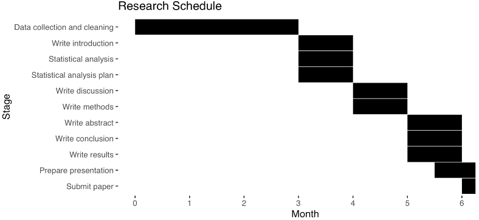

```{r setup, include=FALSE}
library(ggplot2)
library(kableExtra)
library(knitr)
library(bookdown)
knitr::opts_knit$set(root.dir = rprojroot::find_rstudio_root_file())
```

```{r load thesis_source, include=FALSE}

source(file.path("r_docs", "thesis_source.R"))
```

# Abstract

## Introduction

Head injuries, particularly traumatic brain injuries, are severe consequences of car crashes. The Head Injury Criterion (HIC), specifically HIC15 (measuring head acceleration over 15 milliseconds), is a key risk indicator, with higher scores signaling greater injury likelihood. Although MADYMO simulations generate HIC15 scores validated against crash test dummy experiments, their accuracy in predicting real-world head injuries remains unproven. This study compares MADYMO-derived HIC15 values to head injury risks from US national crash data to validate their real-world applicability. It further investigates how crash factors (e.g., delta V, seatbelt use, airbag deployment), occupant characteristics (age, sex, BMI), and environmental variables (car weight, weather) influence the relationship between simulated HIC15 and actual injury outcomes. By analyzing these interactions, the research aims to improve understanding of MADYMO’s predictive utility for real-world head injuries and inform strategies to mitigate such risks in crashes and other scenarios.

## Methods

Using the USA National Highway Traffic Safety Administration's (NHTSA) NASS-CDS (National Automotive Sampling System Crashworthiness Data System) database, the research compares MADYMO's HIC15 values with real-world head injury. The study population consists of NASS-CDS records from 2000 to 2015 (16 years inclusive), which includes 150,897 occupants in 126,049 vehicles involved in USA car crashes during this period.

First a univariate logistic regression model will compare HIC15 to head injury. Then multivariate models will be built, one model incorporating occupant-related variables (*e.g.*, age, sex, body mass index) and another incorporating environmental variables (*e.g.*, vehicle weight, year). The purpose of this is to examine the effects of the simulation's occupant separately from its environment. Then a final multivariate logistic regression model will include all covariates that were found to be significant, stratifying the analysis where appropriate if effect modification is found.

The predictive performance of the HIC15 will be shown using positive predictive value for each model. Establishing the degree of correlation between HIC15 and head injury can provide insight into the degree of utility of HIC15 for assessing head injury risk in vehicle safety testing and in other engineering and design applications, as well as for forensic medical and engineering disciplines.

# Introduction

## Background

Head injuries represent one of the most significant consequences of motor vehicle collisions and carry profound implications for morbidity, mortality, and long-term disability. In 2020 in the United States, 214,110 hospitalizations and 69,473 deaths were traumatic brain injury (TBI)-related[@prevention2024]. Car crashes accounted for 17% of all TBI-related deaths in the US in 2018 and 2019[@prevention2022]. These figures do not include the unknown number of occupants who sustain a crash-related mild TBI (*i.e.,* concussion) and are not hospitalized for their injuries. Such injuries are associated with the potential for long-term debilitating cognitive, physical, and psychological sequelae[@rabinowitz2014], including memory loss, behavioral change, and inability to perform activities of daily living, among others.

MADYMO (MAthematical DYnamic MOdels) is a finite element modeling program that is used as an automotive industry standard for simulating car crashes. The software can provide, for each virtual human body in a simulation, injury metrics, like the Head Injury Criterion (HIC).

The formula for HIC is below:

$$
HIC = \left\{
(t_2 - t_1) \left[ \frac{1}{(t_2 - t_1)} \int_{t_1}^{t_2} a(t) \, dt \right]^{2.5}
\right \}_\text{max} \quad 
$$

Where t~1~ is the initial and t~2~ is the final integration time, a(t) is the acceleration (a, in gravity units [g], t is time in seconds) integrated versus time. The HIC15 refers to the acceleration on a head over 15 milliseconds. The HIC15 metric has been used for decades to assess vehicle safety performance based on the use of anthropomorphic test dummies (ATD, also known as crash test dummies) in staged test collisions.

The MADYMO program, which consists of a finite element model of an ATD in a test environment, allows for non-destructive testing of vehicle design changes, as well as a multitude of other applications that might involve the use of an ATD. The HIC15 output resulting from MADYMO analysis has been validated against real-world HIC15 measurements in full-scale ATD tests[@thorbole]. Although some authors have attempted to match *post hoc* MADYMO HIC15 analyses and select real-world crash and pedestrian injury outcomes[@shang2021; @yang2019; @chevalier2019], no prior investigations have attempted to evaluate how well MADYMO-derived HIC predicts injury for larger population of occupants of car crashes. This relationship between prior publications and the present research is illustrated in the figure below:


No previously published research has examined the effect that predictive features of the car crash have on the HIC15’s association with real-world injury, *e.g.,* crash severity, measured by change in velocity of the crash (also known as *delta V*), seat position, seatbelt use, and airbag deployment.

Since 1979, the NASS-CDS (National Automotive Sampling System-Crashworthiness Data System) from the US National Highway Traffic Safety Administration's (NHTSA) has existed as a database of around 5,000 crashes investigated each year, resulting in a publicly available database of crashes and the injuries that they cause[@administration2024]. The sampled crashes are drawn from 24 to 36 “Primary Sampling Units,” which are nationally representative geographic areas, and the results of the investigations are weighted to yield a national estimate[@zhangf2019]. These data will be used to validate MADYMO’s HIC15 metric.

## Aim

The aim of this study is to determine how well MADYMO’s HIC15 measurements predict real-world head injury observations taken from the NHTSA NASS-CDS database. The study will also observe the effect that crash variables (delta V, seat position, seatbelt use, and airbag deployment), occupant-related variables (age, sex, BMI), and environmental variables (vehicle weight, make, year, etc.) have on this relationship.

## Research question

What is the association between MADYMO-generated Head Injury Criterion values and head injury risk in real-world car crashes?[^1]

[^1]: The traditional PICO structure is not applicable to a validity study; in this research, the Patient/population can be seen as the NHTSA NASS CDS dataset, the Intervention/exposure and Control value can be seen as the HIC15 value, and Outcome can be seen as head injury as seen in the NHTSA NASS CDS dataset.

## Sub-questions

How is the relationship influenced by the crash-specific variables seat position (driver/front passenger), seatbelt use, airbag deployment, and speed of crash?

How do occupant-specific variables affect this relationship, including age, sex, and BMI?

How do environmental variables affect this relationship, including vehicle weight and year?

## Hypotheses

There is a reliably predictive relationship between MADYMO-generated HIC15 values and head injury risk.

The relationship between MADYMO-generated HIC15 values and head injury risk as recorded by NHTSA's NASS-CDS program is not influenced by these variables: speed of crash, seat position, seatbelt use, airbag deployment, sex, age, BMI, vehicle weight, vehicle year, weather, and other variables.

# Methods

## Study design

This is a retrospective construct validation study. The study aims to determine how well HIC15 scores from crash simulations predict real-world head injury risk. Two datasets will be used: (1) simulated crashes from MADYMO (a collection of 488 simulations that vary by impact speed, seat position, seatbelt use, and airbag deployment) and (2) real crash data from NHTSA’s NASS-CDS (including injury outcomes, seatbelt use, airbag status, and delta V). The NASS-CDS is an annually repeated cross-sectional observational study that was active from 1979 to 2015 in the US. The goal of the NASS-CDS was to collect and make publicly available motor vehicle crash data for improvement of safety systems in the automotive industry.

Each real-world crash occupant included from the NASS-CDS data will be matched to a MADYMO simulation with the same speed (delta V), seat position, seatbelt use, and airbag status, so that each real crash occupant included in the study has a simulated HIC15 value.

## Study population

NHTSA, a branch of the United States Department of Transportation, began investigating and cataloging injuries sustained by Americans who were involved in car crashes under the NASS-CDS program in 1979[@zhangf2019a]. The records of this project contain detailed information about the circumstances about the crash (taken from police records), the physical features of each individual involved, and the medical diagnoses that were given at or around the time of the crash, including the severity, anatomic location, and nature of injury derived from medical records[@seymourstern1998].

```{r, echo=FALSE}
table_1
```

The NASS-CDS was meant to be an accurate representation of the total US population, so it used a complex weighting system to ensure that each year's data can be accurately extrapolated to represent the rest of the country. The population included both injured and healthy Americans.

This study will examine the NASS-CDS database from the years 2000 to 2015 (16 years, inclusive). This database consists of 150,897 occupants of any age who were involved in car crashes in these years in the United States, specifically in the jurisdictions from which NHTSA took their samples.

Occupants will only be included in the study if the crash was a single impact to their front of their vehicle, the impact was between 5 and 65 miles per hour delta V, and there was no missing data for seatbelt use, airbag deployment, or head injury. This results in a dataset of 16,212 participants.

## Measurement instruments

## MADYMO Data and HIC15

MADYMO is a finite element modeling program, meaning that it simulates physical realities by numerically solving differential equations. A MADYMO model is built by connecting small objects to become any number of larger objects, which can be a human body, a car structure, an airbag, or even the gas inside the airbag. The program allows for the measurement of position, movement, and acceleration of any object in the simulation. In the case of the HIC15, acceleration is measured on the head of the human body object.

The HIC is a function of the measurement of acceleration on the head over a period of either 15 or 36 milliseconds, centered around the point of highest acceleration. The HIC15 is the automotive industry standard **(11)** that will be used in this study. The resulting HIC15 score is hypothesized to be associated with probability of head injury, separated by severity as seen below:

![Hypothetical probabilities of head injury of different severities as a function of HIC15 score[@yang2019a]](images/clipboard-755877176.png)

HIC15 values are taken from the madymo.peak file that is created by a MADYMO simulation. These values are extracted using a custom document-searching function in R and assembled into a dataset that includes these variables: DV_MPH (delta V - miles per hour - continuous), SEATPOS (seat position - driver/front passenger, categorical), BELTUSE_BIN (seatbelt use - binary), BAGDEPLOY_BIN (airbag deployment - binary), HIC15 (HIC15 value with 15 millisecond window - continuous), and HIC15_log (HIC15 value transformed by natural logarithm because cursory examination revealed log-normal distribution).

MADYMO simulations are organized into a file system (see figure 4) organized with this nesting structure:

DV_MPH \> SEATPOS \> BELTUSE_BIN \> BAGDEPLOY_BIN.

This structure gives every DV_MPH (5 - 65 mph delta V) value 8 unique simulations differentiated by the values of SEATPOS, BELTUSE_BIN, and BAGDEPLOY_BIN, resulting in 488 simulations.


The library of MADYMO models consists of the driver and passenger versions of the FORTE Active Human Body Model (included with the software), adjusted for delta V, seatbelt use, and airbag deployment; otherwise, no adjustments were made to the default settings. This model has been shown to have "good correlation,"[@tran2022] with real human motion data in one study.

## NHTSA data

The accuracy of the NASS-CDS's delta V values, taken from WinSMASH (a damage-based crash reconstruction program), has been compared with the recorded acceleration data taken from the vehicle's internal computer and found that the WinSMASH values overestimate delta V by 13 percent overall for cars struck by other cars and 2 percent for cars struck by light trucks and vans[@johnson2014]. Analyzing the vehicle's computer data for delta V would have to be done manually and would not be feasible for this study; therefore, the WinSMASH delta V values will be used.

The separate NHTSA NASS-CDS files from each year (separated between passenger details, injuries, vehicle information, and other types of data) will be joined in R using the variables PSU, CASEID, VEHNO, and OCCNO; this will ensure that each occupant is correctly matched to their respective crash and vehicle. The joined datasets from all available years will be combined into a single dataset. The MADYMO dataset will be joined to this, matching the variables DV_MPH, SEATPOS, BELTUSE_BIN, and BAGDEPLOY_BIN.

Four important variables will determine the physical features of each crash: delta V (DV_MPH - continuous, 5-65), seat position (SEATPOS - categorical, driver/front passenger), seatbelt use (BELTUSE_BIN - binary), airbag deployment (BAGDEPLOY_BIN - binary).

The NHSA dataset will be filtered to include only crashes with the following parameters (occupants with missing data for any of these variables will be excluded): delta V: 5 - 65 mph, crash direction: Frontal (single impact), occupant seat: Driver or front passenger.

The final NHTSA dataset will retain the following variables: AGE, BAGDEPLOY_BIN, BELTUSE_BIN, SEATPOS, BMI, DV_MPH, HIPR, ID, MAKE, MODELYR, SEX_BIN, TIME, VEHTYPE, VEHWGT, WEATHER, YEAR. These are defined below:

Age (AGE - years, continuous) and SEX are recorded by interview or if not available, through police reports and other official records. Airbag deployment (BAGDEPLOY_BIN - binary) and seat position (SEATPOS - categorical) are determined through vehicle inspection. BAGDEPLOY_BIN is constructed in R, where BAGDEPLY = 1 is positive airbag deployment, as it is defined as "deployed during crash (as a result of impact)," and all other options are considered no airbag deployment. BELTUSE_BIN is constructed in R by separating the seatbelt use variable MANUSE into two categories: 1 for "lap and shoulder belt" or 0 for anything else. BMI (BMI - continuous) is calculated in R by dividing WEIGHT (kg) by HEIGHT (m)-squared. Delta V in miles per hour (DV_MPH - mph, continuous) is constructed in R by multiplying DVTOTAL (taken from the WinSMASH crash reconstruction program[@niehoff2006]) by 0.621371 and then rounded to the nearest whole number to match the MADYMO dataset's DV_MPH whole-number values. Head injury (HIPR - binary) is 1 when the variable LESION has the value "K," and is otherwise 0. ID (categorical) is a unique number for each occupant in the final dataset. MAKE (categorical) and MODELYR (continuous) are the make and model of the vehicle the occupant was in during the crash, gathered from vehicle inspection. Binary sex (SEX_BIN - binary) is constructed in R from SEX, with 1 being male and 0 being female. TIME (interval, minutes) is the time of day of the crash. Vehicle type (VEHTYPE - categorical) is the body-type of the vehicle. Vehicle weight (VEHWGT - continuous, kg) is the weight of the vehicle, taken during vehicle inspection. WEATHER (categorical) is the weather at the time of the crash, taken from the police report. YEAR (categorical) is the year of the crash, taken from the NHTSA file.

# Sources of bias

## Information bias

Height and weight are gathered through either medical records or interviews; in the latter case, self-reported measurements in general are subject to inaccuracy and could distort the relationships. If either measurement is overestimated, there may be an overestimation of the effect size, and vice versa. In converting kilometers per hour to miles per hour in the NHTSA data, then rounding the number to match the MADYMO simulations' delta V values in mph, there may be some loss in resolution of the original delta V. The BELTUSE_BIN variable only considers lap and shoulder belt use to be seatbelt use. Occupants who only wear lap belts or shoulder belts are considered not belted. Milder TBI injuries, which are diagnosed via post-crash history and symptoms, could be missed by the NHTSA researchers because of a lack of serious symptoms, leading to an overestimation of the effect of HIC15 on head injury.

## Confounding bias

Potential confounders or effect modifiers that will be investigated in the logistic analyses are delta V, seat position, seatbelt use, airbag deployment, age, sex, BMI, car make and weight and model year, and weather. The MADYMO simulations use a 50th-percentile (average weight and height) dummy, ignoring biological diversity; older adults, for example, may have higher head injury risk for the same HIC15 due to reduced bone density, and shorter individuals may experience different seatbelt/airbag interaction, increasing injury risk. These biological variations might introduce error and reduce the HIC15-head injury correlation. Newer vehicles or high-quality makes often incorporate advanced technologies (*e.g.*, side-curtain airbags, reinforced structures) that reduce head injury risk independently of HIC15, while older vehicles may lack these protections; this may obscure the association between HIC and head injury. Variations in seatbelt design (*e.g.*, load limiters, pretensioners) or airbag deployment timing could also distort the HIC15-head injury relationship. Adverse weather conditions (fog, rain) might augment the effect of HIC15 on head injury, if for example the occupant does not see the car coming through the weather and doesn't brace for the impact. Vehicle weight, make, and model year may each alter the HIC15-head injury relationship; higher weight leading to overestimation of injury, more "high-end" makes and more recent model years potentially causing underestimation of injury because safety technology has improved over time.

```{r, echo=FALSE}
interaction_grid_viz
interaction_grid_viz_new_bmi_split
```

## Selection bias

The NASS-CDS only took place in the USA. The results may not be generalizable to international populations.

# Main statistical analysis techniques

All data manipulation and analyses will be done in R (version 4.4.2)[@team2024].

## Descriptive statistics

The summarized variables will be displayed in a table, separated by their head injury status. Continuous variables with normal distribution will be summarized by a mean value and standard deviation. Non-normally distributed continuous variables will be summarized by a mean value and interquartile range. Categorical variables will be summarized with a count and percentage of the total for each level. A final column will display the P-value from an appropriate statistical test comparing the values in the two columns.

## Checking assumptions

Logistic regression assumes normal predictor distribution and independence. The distribution of the predictors will be visually inspected with histograms. If non-normal distribution is found, transformation will be considered, depending on the severity of the abnormality. Multicollinearity can be tested with the variance inflation factor (VIF). If the VIF of the final model shows a higher value than 10 on any two variables, one should be removed from the model to avoid instability and unreliable estimates.

## Univariate logistic regression analysis

The first step will be to perform a univariate logistic regression analysis of HIC15 (primary predictor - continuous) versus head injury (outcome - binary), to show the direct effect of HIC15 on head injury. The results of this and all other analyses will be an odds ratio (OR) with 95% confidence intervals (CIs) and two-tailed P-values, and a positive predictive value (PPV) will be derived from each model. This model represents the ability for the HIC15 to predict a head injury. A cursory examination of the data revealed that HIC15 is not normally distributed, but becomes normal when log-transformed, so a new variable HIC15_log will be created as the natural log of the predictor and used in the regression.

## Multivariate logistic regression analysis

A three-step multivariate model will be built. The first step introduces each of these crash-related variables to the univariate model one at a time: DV_MPH (continuous), SEATPOS (binary), BELTUSE_BIN (binary), and BAGDEPLOY_BIN (binary). This model demonstrates how accurately HIC15 predicts head injury when considering these four variables. Variables will be kept in the model and considered confounders if they are significant (two-tailed P-value \< 0.05), in this and all multivariate models. Effect modification will be investigated for all statistically significant confounders as they are added to the models. The model will be stratified along any categorical variables that are found to be effect modifiers, and if the effect modifier is a continuous variable, a categorical version of the variable will be created to stratify the analysis. The second step consists of two separate models; one adds to the first multivariate model the occupant-related variables (*e.g.*, age, sex, body mass index); the second model adds only the environmental variables (*e.g.*, vehicle weight, year). The final step will be to create a model that includes all covariates that were found to significantly influence the relationship between HIC15 and head injury. The predictive performance of the HIC15 will be shown using positive predictive value for each model. Assessing the relationship with different groups of covariates can give insight into the predictive value of specific elements (body, vehicle) of the MADYMO simulation.

The results of these models will also be presented as an OR with 95% CIs and P-values for each variable, and PPV will be derived from each model. A mediation analysis using the mediation R package[@dustintingley2014] will help determine if any of the variables in the models are mediators. In the case that they are, the causal pathway of the model can be examined with a directional acyclic graph and discussed.

```{r, echo=FALSE}
univariate_final_roc_grid_viz
models_listwise_comparison_df
```

## Sensitivity analysis and model comparison

The PPVs of the models will be compared, examining the difference in the ability for the MADYMO HIC15 to predict head injuries without and with the other variables that had significant effects on the model.

# Power analyses

A power calculation was performed in G\*Power 3.1[@faul2007] to determine the minimum detectable OR between an imagined "Low HIC15" and "High HIC15" groups, representing the lowest and highest quintiles, respectively.

To test this, a z test of proportions was chosen. A z test for independent proportions assumes that the observations are independent and there is sufficient sample size. To prove sufficient sample size, successes and failures in both groups must be more than 10[@agresti2017], which they are.

Given a power of 0.80 and alpha of 0.05, a sample size of 8,000 in each group (the known total sample size is \~16,000), and a prevalence of head injury in the Low HIC15 group of 5%, the software determined that the minimum detectable prevalence for the High HIC15 group would be 6.444%, meaning a minimum detectable OR of 1.29.

A second power calculation was performed with a power of 0.95. In this scenario the software determined that the minimum detectable prevalence for the High HIC15 group would be 7.392%, meaning a minimum detectable OR of 1.48.

These results indicate that, assuming a 5% head injury prevalence in the lowest HIC15 quintile, the highest HIC15 quintile would need to exhibit a prevalence between 6.444% and 7.392% to achieve statistical significance under the specified parameters. This corresponds to minimum detectable ORs of 1.29 (80% power) and 1.48 (95% power). Thus, to detect a statistically significant association between HIC15 quintiles and head injury risk, the highest quintile must demonstrate a 29% to 48% increase in the odds of head injury compared to the lowest quintile, depending on the desired statistical power.

These results suggest that the study will have sufficient power if an odds ratio of 1.29 is found between the lowest and highest quintiles, which is reasonable to expect.

# Ethical statement

This study did not require Institutional Review Board (IRB) approval or informed consent because the anonymized data from NHTSA are publicly available and do not present a risk of violating the privacy of any individual[@administration2024a].

Details about the NASS-CDS procedures for obtaining informed consent and ethical oversight have proven difficult to find.

The data from the MADYMO simulations also does not require IRB approval or informed consent because the data comes from simulated human bodies and not from human subjects.

The NHTSA and MADYMO data will be stored locally on a password protected computer and on Maastricht University's secure cloud servers. The data collection, cleaning, and analysis will be done in R on the researcher's personal computer.

Intent to publish has not yet been decided by the supervisors. It will be determined as the internship progresses.

# Funding statement

Forensic Research + Analysis (FR+A) is funding this research via Maastricht University (UM).

# Conflict of interest statement

JF is employed by UM and FR+A. The results of this research may be referred to in reports written by FR+A.

# Timeline

Over 2 years the research project is split into two stages: the first stage will focus on data collection and cleaning, and the second stage will focus on the statistical analysis and writing the report. The first stage will take place between April and June 2024, and the second stage will take place between April and June 2025.

The data will be collected in April 2024 and cleaned and prepared until June 2024.

The approach for statistical analysis will be determined in April 2025 and the analysis will begin in that same time. The outcomes from the statistical analysis will be available in May 2025, and the final draft of the report will be complete by the end of June 2025 to be submitted by July 4, 2025.



# Potential Impact

If the results of this study show a significant relationship between MADYMO’s HIC15 measurement and head injury, MADYMO could be used more with more confidence to predict head injury from car crash simulations. This could impact the automotive industry by adjusting how car safety design is approached, and an efficient method of predicting injury could benefit forensic medicine/epidemiology, where the etiology of a head injury can determine whether an individual’s healthcare costs are compensated by an insurance company.

\newpage

# References
