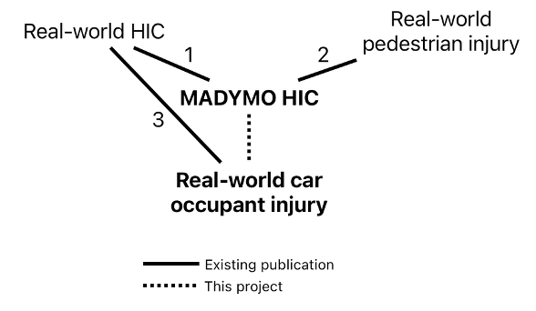
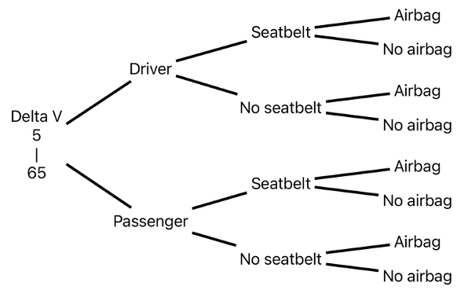

---
''---
csl: https://raw.githubusercontent.com/citation-style-language/styles/refs/heads/master/elsevier-vancouver.csl
link-citations: true
citation-abbreviations: true
output: 
    bookdown::pdf_document2:
      includes:
        in_header: import.sty
        before_body: title.sty
      keep_tex: yes
      number_sections: yes
      # toc: no
      toc: false
bibliography: references.bib
---

```{r setup, include=FALSE}
library(ggplot2)
library(kableExtra)
library(knitr)
library(bookdown)
knitr::opts_knit$set(root.dir = rprojroot::find_rstudio_root_file())
```

```{r load thesis_source, include=FALSE}
source(file.path("r_docs", "thesis_source.R"))
```

# Abstract

## Introduction {#introduction}

Head injuries, particularly traumatic brain injuries, are severe consequences of car crashes. The Head Injury Criterion (HIC), specifically HIC15 (measuring head acceleration over 15 milliseconds), is a key risk indicator, with higher scores signaling greater injury likelihood. Although MADYMO simulations generate HIC15 scores validated against crash test dummy experiments, their accuracy in predicting real-world head injuries remains unproven. This study compared MADYMO-derived HIC15 values to head injury risks from US national crash data to validate their real-world applicability. It further investigated how crash factors (e.g., speed of crash, seatbelt use, airbag deployment), occupant characteristics (age, sex, BMI), and environmental variables (weather, time of day, and vehicle type, make, weight, and year) influence the relationship between simulated HIC15 and actual injury outcomes. By analyzing these interactions, the research aimed to improve understanding of MADYMO’s predictive utility for real-world head injuries.

## Methods

Using the USA National Highway Traffic Safety Administration's (NHTSA) NASS-CDS (National Automotive Sampling System Crashworthiness Data System) database, the [**research compared MADYMO's HIC15 values with real-world head injury (redundant)**]{.underline}. The study population consisted of NASS-CDS records from 2000 to 2015 (16 years inclusive), which included 150,897 occupants in 126,049 vehicles involved in USA car crashes during this period.

First a univariate logistic regression model compared HIC15 to head injury. Then multivariate models were built, one model incorporating occupant-related variables (*e.g.*, age, sex, body mass index) and another incorporating environmental variables (*e.g.*, vehicle weight, year). The purpose of this was to examine the effects of the simulation's occupant separately from its environment. Then a final multivariate logistic regression model included all covariates that were found to be significant, stratifying the analysis where appropriate if effect modification was found.

The predictive performance of the HIC15 was examined using area under curve (AUC) values for each model.

[**Paragraph on results and discussion**]{.underline}

# Introduction

## Background {#intro-background}

Head injuries represent one of the most significant consequences of motor vehicle collisions and carry profound implications for morbidity, mortality, and long-term disability. In 2020 in the United States, 214,110 hospitalizations and 69,473 deaths were traumatic brain injury (TBI)-related[@prevention2024]. Car crashes accounted for 17% of all TBI-related deaths in the US in 2018 and 2019[@prevention2022]. These figures do not include the unknown number of occupants who sustain a crash-related mild TBI (*i.e.,* concussion) and are not hospitalized for their injuries. Such injuries are associated with the potential for long-term debilitating cognitive, physical, and psychological sequelae[@rabinowitz2014], including memory loss, behavioral change, and inability to perform activities of daily living, among others.

-   discuss mechanics of head injury
-   TALK ABOUT OTHER PAPERS

MADYMO (MAthematical DYnamic MOdels) is a finite element modeling program that is used as an automotive industry standard for simulating car crashes. The software can provide, for each virtual human body in a simulation, injury metrics, like the Head Injury Criterion (HIC).

The formula for HIC is below:

$$
HIC = \left\{
(t_2 - t_1) \left[ \frac{1}{(t_2 - t_1)} \int_{t_1}^{t_2} a(t) \, dt \right]^{2.5}
\right \}_\text{max} \quad 
$$

Where t~1~ is the initial and t~2~ is the final integration time, a(t) is the acceleration (a, in gravity units [g], t is time in seconds) integrated versus time. The HIC15 refers to the acceleration on a head over 15 milliseconds. The HIC15 metric has been used for decades to assess vehicle safety performance based on the use of anthropomorphic test dummies (ATD, also known as crash test dummies) in staged test collisions.

The MADYMO program, which consists of a finite element model of an ATD in a test environment, allows for non-destructive testing of vehicle design changes, as well as a multitude of other applications that might involve the use of an ATD. The HIC15 output resulting from MADYMO analysis has been validated against real-world HIC15 measurements in full-scale ATD tests[@thorbole]. Although some authors have attempted to match *post hoc* MADYMO HIC15 analyses and select real-world crash and pedestrian injury outcomes[@shang2021; @yang2019; @chevalier2019], no prior investigations have attempted to evaluate how well MADYMO-derived HIC predicts injury for larger population of occupants of car crashes. This relationship between prior publications and the present research is illustrated in the figure below:



No previously published research has examined the effect that predictive features of the car crash have on the HIC15’s association with real-world injury, *e.g.,* crash severity, measured by change in velocity of the crash (also known as *delta V*), seat position, seatbelt use, and airbag deployment.

Since 1979, the NASS-CDS (National Automotive Sampling System-Crashworthiness Data System) from the US National Highway Traffic Safety Administration's (NHTSA) has existed as a database of around 5,000 crashes investigated each year, resulting in a publicly available database of crashes and the injuries that they cause[@administration2024]. The sampled crashes are drawn from 24 to 36 “Primary Sampling Units,” which are nationally representative geographic areas, and the results of the investigations are weighted to yield a national estimate[@zhangf2019]. These data will be used to validate MADYMO’s HIC15 metric.

## Aim

The aim of this study is to determine how well MADYMO’s HIC15 measurements predict real-world head injury observations taken from the NHTSA NASS-CDS database. The study will also observe the effect that crash variables (delta V, seat position, seatbelt use, and airbag deployment), occupant-related variables (age, sex, BMI), and environmental variables (vehicle weight, make, year, etc.) have on this relationship.

## Research question

What is the association between MADYMO-generated Head Injury Criterion values and head injury risk in real-world car crashes?[^1]

[^1]: The traditional PICO structure is not applicable to a validity study; in this research, the Patient/population can be seen as the NHTSA NASS CDS dataset, the Intervention/exposure and Control value can be seen as the HIC15 value, and Outcome can be seen as head injury as seen in the NHTSA NASS CDS dataset.

## Sub-questions

How is this relationship influenced by the crash-specific variables seat position (driver/front passenger), seatbelt use, airbag deployment, and speed of crash?

How do occupant-specific variables affect this relationship, including age, sex, and BMI?

How do environmental variables affect this relationship, including weather, time of day, and vehicle type, make, weight, and year?

## Hypotheses

Higher scores of MADYMO-generated HIC15 values are associated with greater head injury risk under all car crash scenarios.

The relationship between MADYMO-generated HIC15 values and head injury risk as recorded by NHTSA's NASS-CDS program is thus not influenced by these variables: speed of crash, seat position, seatbelt use, airbag deployment, sex, age, BMI, weather, time of day, vehicle type, weight, make, and year.

# Methods

## Dataset

Two datasets will be merged: (1) simulated crashes from MADYMO (a collection of 288 simulations that vary by impact speed, seat position, seatbelt use, and airbag deployment) and (2) real crash data from NHTSA’s NASS-CDS (including injury outcomes, seatbelt use, airbag status, and delta V). The NASS-CDS is an annually repeated cross-sectional observational study that was active from 1979 to 2015 in the US. The goal of the NASS-CDS was to collect and make publicly available motor vehicle crash data for improvement of safety systems in the automotive industry.

Each real-world crash occupant included from the NASS-CDS data will be matched to a MADYMO-generated HIC15 value. Matching was performed on: crash speed (delta V), seat position, seatbelt use, and airbag status, so that each real crash occupant included in the study has a simulated HIC15 value.

## Study population

NHTSA, a branch of the United States Department of Transportation, began investigating and cataloging injuries sustained by Americans who were involved in car crashes under the NASS-CDS program in 1979[@zhangf2019a]. The records of this project contain detailed information about the circumstances about the crash (taken from police records), the physical features of each individual involved, and the medical diagnoses that were given at or around the time of the crash, including the severity, anatomic location, and nature of injury derived from medical records[@seymourstern1998].

$$
\\
$$

```{r, echo=FALSE, fig.cap = "Baseline Characteristics of Study Population"}
table_1
```

$$
\\
$$

The NASS-CDS was meant to be an accurate representation of the total US population, so it used a complex weighting system to ensure that each year's data can be accurately extrapolated to represent the rest of the country. The population included both injured and healthy Americans.

This study will examine the NASS-CDS database from the years 2000 to 2015 (16 years, inclusive). This database consists of 113,579 occupants of any age who were involved in car crashes in these years in the United States, specifically in the jurisdictions from which NHTSA took their samples.

Occupants will only be included in the study if the crash was a single impact to their front of their vehicle, the impact was between 5 and 40 miles per hour delta V, they are at least 20 years old, and there was no missing data for seatbelt use, airbag deployment, or head injury. This results in a dataset of 13,482 participants.

## MADYMO Simulations

MADYMO simulations, simply put, are a collection of variables that are put into an engine that plays out simulated physical movement and interaction between objects, recording location, movement, acceleration, and more into files that list the peak values of this. Some of these measurements are also incorporated into mathematical formulas, like the HIC15. These variables can be adjusted before running the simulation, resulting in different measurements. The variables that you can change include seat position, seatbelt usage, airbag deployment, and speed of the crash, thus these are they variables that are matched to the NHTSA data.

The template simulation used in this paper is the FORTE frontal crash simulation included with the MADYMO software. It uses the Active Human Model 50th Percentile human dummy. More information about this simulation is included in the [**supplemental documents**]{.underline}. A program was written Python to automatically adjust the variables listed above in the simulation template and save the files into a library structure.

{width="360"}

<!-- -   data variables -->

<!-- -   all variables considered for and included in analysis -->

<!-- -   outcomes -->

<!-- -   exposures -->

<!-- -   predictors -->

<!-- -   potential confounders -->

<!-- -   potential effect modifiers -->

<!-- -   adquately describe **diagnostic** criteria -->

[**The main outcome is the presence of head injury and the main predictor is HIC15. Potential confounders were separated into three groups: occupant variables (BMI, age, and sex), environment variables (weather, time of day, and vehicle type, make, weight, and year), and simulation variables (delta V, seat position, seatbelt use, and airbag deployment). Effect modification was suspected for delta V, however any variables found to be statistically significant in the final model will be tested for interaction.**]{.underline}

MADYMO is a finite element modeling program, meaning that it simulates physical realities by numerically solving differential equations. A MADYMO model is built by connecting small objects to become any number of larger objects, which can be a human body, a car structure, an airbag, or even the gas inside the airbag. The program allows for the measurement of position, movement, and acceleration of any object in the simulation. In the case of the HIC15, acceleration is measured on the head of the human body object.

The HIC is a function of the measurement of acceleration on the head over a period of either 15 ms (HIC15) or 36 ms (HIC36), centered around the point of highest acceleration. The HIC15 is the automotive industry standard [@tran2022] that will be used in this study. The resulting HIC15 score is hypothesized to be associated with probability of head injury, separated by severity as seen below:

![Hypothetical probabilities of head injury of different severities as a function of HIC15 score [@yang2019a]](images/clipboard-755877176.png){width="475"}

HIC15 values are taken from the madymo.peak file that is created by a MADYMO simulation. These values are extracted using a custom document-searching function in R and assembled into a dataset that includes these variables: DV_MPH (delta V - miles per hour - continuous), SEATPOS (seat position - driver/front passenger, categorical), BELTUSE_BIN (seatbelt use - binary), BAGDEPLOY_BIN (airbag deployment - binary), HIC15 (HIC15 value with 15 millisecond window - continuous), and HIC15_log (HIC15 value transformed by natural logarithm because cursory examination revealed log-normal distribution).

MADYMO simulations are organized into a file system (see figure 4) organized with this nesting structure:

DV_MPH \> SEATPOS \> BELTUSE_BIN \> BAGDEPLOY_BIN.

This structure gives every DV_MPH (5 - 65 mph delta V) value 8 unique simulations differentiated by the values of SEATPOS, BELTUSE_BIN, and BAGDEPLOY_BIN, resulting in 488 simulations.

{width="318"}

The library of MADYMO models consists of the driver and passenger versions of the FORTE Active Human Body Model (included with the software), adjusted for delta V, seatbelt use, and airbag deployment; otherwise, no adjustments were made to the default settings. This model has been shown to have "good correlation,"[@tran2022] with real human motion data in one study.

## NHTSA data

The accuracy of the NASS-CDS's delta V values, taken from WinSMASH (a damage-based crash reconstruction program), has been compared with the recorded acceleration data taken from the vehicle's internal computer and found that the WinSMASH values overestimate delta V by 13 percent overall for cars struck by other cars and 2 percent for cars struck by light trucks and vans[@johnson2014]. Analyzing the vehicle's computer data for delta V would have to be done manually and would not be feasible for this study; therefore, the WinSMASH delta V values will be used.

The separate NHTSA NASS-CDS files from each year (separated between passenger details, injuries, vehicle information, and other types of data) will be joined in R using the variables PSU, CASEID, VEHNO, and OCCNO; this will ensure that each occupant is correctly matched to their respective crash and vehicle. The joined datasets from all available years will be combined into a single dataset. The MADYMO dataset will be joined to this, matching the variables DV_MPH, SEATPOS, BELTUSE_BIN, and BAGDEPLOY_BIN.

Four important variables will determine the physical features of each crash: delta V (DV_MPH - continuous, 5-65), seat position (SEATPOS - categorical, driver/front passenger), seatbelt use (BELTUSE_BIN - binary), airbag deployment (BAGDEPLOY_BIN - binary).

The NHSA dataset will be filtered to include only crashes with the following parameters (occupants with missing data for any of these variables will be excluded): delta V: 5 - 65 mph, crash direction: Frontal (single impact), occupant seat: Driver or front passenger.

The final NHTSA dataset will retain the following variables: AGE, BAGDEPLOY_BIN, BELTUSE_BIN, SEATPOS, BMI, DV_MPH, HIPR, ID, MAKE, MODELYR, SEX_BIN, TIME, VEHTYPE, VEHWGT, WEATHER, YEAR. These are defined below:

Age (AGE - years, continuous) and SEX are recorded by interview or if not available, through police reports and other official records. Airbag deployment (BAGDEPLOY_BIN - binary) and seat position (SEATPOS - categorical) are determined through vehicle inspection. BAGDEPLOY_BIN is constructed in R, where BAGDEPLY = 1 is positive airbag deployment, as it is defined as "deployed during crash (as a result of impact)," and all other options are considered no airbag deployment. BELTUSE_BIN is constructed in R by separating the seatbelt use variable MANUSE into two categories: 1 for "lap and shoulder belt" or 0 for anything else. BMI (BMI - continuous) is calculated in R by dividing WEIGHT (kg) by HEIGHT (m)-squared. Delta V in miles per hour (DV_MPH - mph, continuous) is constructed in R by multiplying DVTOTAL (taken from the WinSMASH crash reconstruction program[@niehoff2006]) by 0.621371 and then rounded to the nearest whole number to match the MADYMO dataset's DV_MPH whole-number values. Head injury (HIPR - binary) is 1 when the variable LESION has the value "K," and is otherwise 0. ID (categorical) is a unique number for each occupant in the final dataset. MAKE (categorical) and MODELYR (continuous) are the make and model of the vehicle the occupant was in during the crash, gathered from vehicle inspection. Binary sex (SEX_BIN - binary) is constructed in R from SEX, with 1 being male and 0 being female. TIME (interval, minutes) is the time of day of the crash. Vehicle type (VEHTYPE - categorical) is the body-type of the vehicle. Vehicle weight (VEHWGT - continuous, kg) is the weight of the vehicle, taken during vehicle inspection. WEATHER (categorical) is the weather at the time of the crash, taken from the police report. YEAR (categorical) is the year of the crash, taken from the NHTSA file.

# Sources of bias

## Information bias

Height and weight are gathered through either medical records or interviews; in the latter case, self-reported measurements in general are subject to inaccuracy and could distort the relationships. If either measurement is overestimated, there may be an overestimation of the effect size, and vice versa. In converting kilometers per hour to miles per hour in the NHTSA data, then rounding the number to match the MADYMO simulations' delta V values in mph, there may be some loss in resolution of the original delta V. The BELTUSE_BIN variable only considers lap and shoulder belt use to be seatbelt use. Occupants who only wear lap belts or shoulder belts are considered not belted. Milder TBI injuries, which are diagnosed via post-crash history and symptoms, could be missed by the NHTSA researchers because of a lack of serious symptoms, leading to an overestimation of the effect of HIC15 on head injury.

## Confounding bias

Potential confounders or effect modifiers that will be investigated in the logistic analyses are delta V, seat position, seatbelt use, airbag deployment, age, sex, BMI, car make and weight and model year, and weather. The MADYMO simulations use a 50th-percentile (average weight and height) dummy, ignoring biological diversity; older adults, for example, may have higher head injury risk for the same HIC15 due to reduced bone density, and shorter individuals may experience different seatbelt/airbag interaction, increasing injury risk. These biological variations might introduce error and reduce the HIC15-head injury correlation. Newer vehicles or high-quality makes often incorporate advanced technologies (*e.g.*, side-curtain airbags, reinforced structures) that reduce head injury risk independently of HIC15, while older vehicles may lack these protections; this may obscure the association between HIC and head injury. Variations in seatbelt design (*e.g.*, load limiters, pretensioners) or airbag deployment timing could also distort the HIC15-head injury relationship. Adverse weather conditions (fog, rain) might augment the effect of HIC15 on head injury, if for example the occupant does not see the car coming through the weather and doesn't brace for the impact. Vehicle weight, make, and model year may each alter the HIC15-head injury relationship; higher weight leading to overestimation of injury, more "high-end" makes and more recent model years potentially causing underestimation of injury because safety technology has improved over time.

## Selection bias

The NASS-CDS only took place in the USA. The results may not be generalizable to international populations.

## Statistical Analysis {#statisticalanalysis}

All data manipulation and analyses will be done in R (version 4.4.2)[@team2024].

### Descriptive statistics

The summarized variables will be displayed in a table, separated by their head injury status. Continuous variables with normal distribution will be summarized by a mean value and standard deviation. Non-normally distributed continuous variables will be summarized by a mean value and interquartile range. Categorical variables will be summarized with a count and percentage of the total for each level. A final column will display the P-value from an appropriate statistical test comparing the values in the two columns.

### Checking assumptions

Logistic regression assumes normal predictor distribution and independence. The distribution of the predictors will be visually inspected with histograms. If non-normal distribution is found, transformation will be considered, depending on the severity of the abnormality. Multicollinearity can be tested with the variance inflation factor (VIF). If the VIF of the final model shows a higher value than 10 on any two variables, one should be removed from the model to avoid instability and unreliable estimates.

### Statistical analysis

Missing data will be dealt with by creating and comparing two analyses: one with missing data imputed using multiple imputation and one where all observations with missing data are excluded from analysis (listwise-deleted). The imputed dataset will be preferred for analysis because more observations provide more power, but if the models differ (in variable selection or coefficients \>10%), the listwise dataset will be used; differing results suggest imputation biases results. For each of these datasets, a univariate and several multivariate logistic regression models will be built using the survey package [@survey] to incorporate the random effects and weighting of complex survey structure in the data and ensure that the results are representative of the US population as a whole. The multivariate models will introduce in batches the occupant, environment, and simulation variables, excluding variables that are found to not be statistically significant (p \<0.05). A final model for each dataset will include all relevant variables. These models will be compared and one dataset will be chosen for the rest of the analysis.

The remaining univariate and final models will be compared to determine which will represent the relationship between HIC15 and head injury. ROC curves and AUC measurements will determine the predictive performance of each model. If the final model performs significantly (\>10%) better than the univariate model, it will be chosen, otherwise the univariate model will represent the relationship between HIC15 and head injury.

<!-- -   data sources and measurement -->

<!-- -   what was measured -->

<!-- -   how measurements were made -->

<!-- -   exposures, confounders, outcomes -->

<!-- -   measurement tools validations or designed for this study? -->

<!-- -   HIC -->

<!-- -   potential sources of **bias** -->

<!-- -   information and measurement bias -->

<!-- -   not confounding, goes in data sources/measurement section -->

<!-- -   study size -->

<!-- -   how study size was arrived at -->

<!-- -   sample size calculation (G\*Power) -->

<!-- -   methods of statistical analysis -->

<!-- -   all methods, including confounding analysis -->

<!-- -   enough details of test for someone else to do again -->

<!-- -   more than just names of tests -->

<!-- -   make an **outline map** of stats process -->

<!-- -   discuss adjustment for confounding -->

<!-- -   stratification -->

<!-- -   multivariate analysis -->

<!-- -   p-value cutoff for statistical significance -->

<!-- -   statistics software/packages -->

<!-- -   full code included in supplementary files -->

<!-- -   missing data, how was dealt with -->

<!-- -   match statistical methods with research question -->

<!-- -   how does analysis answer all research questions? -->

<!-- -   ethics approval -->

<!-- -   if applicable, otherwise describe why not -->

<!-- -   recipe listing all ingredients and steps to recreate research -->

<!-- -   **GO THROUGH CODE FOR ALL STEPS** -->

<!-- -   someone should be able to replicate study from this section; if too much information, separate out for supplementary section -->

<!-- -   **from kay**: -->

<!-- -   measurement instruments -->

<!-- -   make main predictor, main outcome very clear -->

<!-- -   what is HIC36 and why is it not used? -->

<!-- -   variables didn’t belong here? not sure, but there is a place for it in new structure -->

<!-- -   statistical analysis -->

<!-- -   explain appropriate statistical tests for **descriptives** -->

<!-- -   power analysis -->

<!-- -   g\*power screenshot? -->

# **Results**

Following the dataset selection process described in \@ref(statisticalanalysis), the final logistic regression models of each dataset were indeed different, and the listwise-deleted dataset (n = 8,425) was therefore chosen for further analysis. The univariate model showed an odds ratio of `r round(exp(univariate_model_listwise$metrics$beta), digits = 2)` for HIC15, with a p-value of \<0.001 and an AUC of 0.7, indicating a good predictive ability for head injury. The final multivariate model included BMI and delta V as covariates, with an odds ratio of `r round(exp(multivariate_model_listwise_final$metrics$beta), digits = 2)` for HIC15, a p-value of 0.073, and an AUC of 0.75, indicating a slightly better predictive ability than the univariate model. This higher p-value is expected with the inclusion of delta V as a predictor, as it is highly correlated with HIC15. Another model including interaction terms for the covariates BMI and delta V showed no statistically significant interaction, so these terms were not included in the final model. The ROC curves for both models are shown below.

```{r, echo=FALSE,fig.pos = "H"}
univariate_final_roc_grid_viz
```

The similar curve shapes and AUC values (\<10% difference) suggest that the univariate model is sufficient to represent the relationship between HIC15 and head injury risk, and the final multivariate model does not significantly improve predictive performance. The final multivariate model was therefore not used for further analysis. Below is a table comparing the univariate, final multivariate, and interaction models. $\\$

```{r, fig.cap = "Model comparison", echo=FALSE}
models_comparison_kable
```

$$\\$$

The following figure shows the interaction between BMI and delta V in the final model, with a grid visualization of the predictive ability of HIC15 for different combinations of BMI and delta V values. The interaction was not statistically significant, but it is included here for reference when discussing the results \@ref(discussion).

```{r, fig.cap = "BMI and delta V interaction performance", echo=FALSE}
interaction_grid_viz
```

$$\\$$

[**Unsure if model comparisons should include all predictors for examination**]{.underline}

<!-- -   confounders -->

<!--     -   occupant variables: age, sex, BMI -->

<!--     -   environmental variables: weather, time of day, and vehicle make, model year, weight, and type -->

<!--     -   simulation variables: delta V, seat position, seatbelt use, airbag deployment -->

<!-- -   which were adjusted for -->

<!--     -   **none** in the end, BMI and delta V for investigative purposes -->

<!-- -   category cutoffs/boundaries for categorized continuous vars -->

<!--     -   time -->

<!--         -   0 - 599 (night), 600 - 1199 (morning), 1200 - 1799 (afternoon), 1800 - 2399 (evening) -->

<!-- -   translate estimates into relative/absolute risk for meaningful time period -->

<!-- -   **?** -->

<!-- -   other results -->

<!-- -   odds ratios -->

<!-- -   relative risks -->

<!-- -   other measures of association -->

<!-- -   [**where** do **AUC, beta, se,** etc go?]{.underline} -->

<!-- -   **ALWAYS** present absolute numbers next to relative -->

<!-- -   25% (25/100) in exposed group versus 10% (10/100) in the unexposed group -->

<!-- -   is this kind of presentation relevant for this project? -->

<!-- -   participants -->

<!-- -   recruitment/response of participants -->

<!-- -   detailed info on recruitment at each stage -->

<!-- -   numbers potentially eligible -->

<!-- -   numbers confirmed eligible -->

<!-- -   numbers included in study -->

<!-- -   numbers completing follow-up -->

The inclusion and exclusion criteria for the study were as follows:

```{r, echo=FALSE}
paste(criteria_list)
```

**CHECK LANGUAGE in boxes**

{width="200"}

<!-- -   discuss selection bias -->

<!-- -   selection bias is minimized by the complex survey structures of the NHTSA data, which includes -->

<!-- -   number of participants with **missing** data for each variable **of** **interest** -->

<!-- -   figure out how to represent this - can be done with table or words -->

<!-- -   other analyses -->

<!-- -   analysis of subgroups, interactions, sensitivity analysis, exploratory analysis, post hoc analyses -->

<!-- -   check through code for these, list all analyses done -->

<!-- -   be clear that some findings (i.e., post hoc analyses) are hypothesis generating and have been carried out based on some of the initial results -->

<!-- -   clear, detailed description of what was found -->

<!-- -   results must relate to research question, objectives, and hypotheses -->

<!-- -   be clear about exploratory analyses -->

<!-- -   anything that generates hypothesis instead of testing established one -->

<!-- -   absolute as well as relative risks -->

<!-- -   translate findings to population level -->

# Discussion {#discussion}

The results of this study indicate that MADYMO's HIC15 scores can indeed predict head injury for frontal car crashes in adult US occupants with a good degree of accuracy. An AUC of 0.7 indicates good predictive ability. [**REFERENCE FOR AUC VALUE MEANINGS**]{.underline}

Delta V and BMI were found to significantly influence the relationship between HIC15 and head injury risk in the final model. Delta V as a confounder is expected; as the speed of a crash increases, so do both the predictor, HIC15, and the outcome, risk of head injury. BMI as a confounder is also not surprising; BMI is a known predictor of upper body injury [@zhu2010]. Despite both variables having significance in the model, their inclusion did not meaningfully improve the predictive performance of HIC15.

Variables that were not included in the final model (all except BMI and delta V) were *not* unrelated to head injury; they just did not significantly change the predictive performance of HIC15. This means that HIC15 is a good predictor of head injury risk, regardless of the value of those variables, e.g., HIC15 predicts well both in the morning and night, regardless of the weather, and regardless of the vehicle type, make, model year, and weight.

An analysis of the interaction between BMI and delta V was performed and can be seen in \@ref(results). The analysis split the population by quantiles for both BMI and delta V, into two and three quantiles, respectively. The performance of HIC15 was surprisingly better for occupants with higher BMI values at lower delta V values, but not for lower BMI values. [**MEANING? further discussion points?**]{.underline}

The large sample size is a major strength in this study. As discussed in \@ref(intro-background), small sample size and older simulation models are two likely reasons for Moran's [@moran2004] conclusions that MADYMO was a poor predictor of head injury severity. [**MORE STRENGTHS**]{.underline}

Weaknesses of the study include the inflexibility of the MADYMO model, specifically that it only accommodates a dummy model with 50th percentile height and weight, *i.e.*, an average male body. The dataset concerns only US drivers, so the study may not be relevant to drivers outside of that country. The data also only examines frontal crashes, so the results may not be applicable to other crash types, such as rear or side impacts or rollovers.

<!-- -   main findings -->

<!-- -   identify main results -->

<!-- -   make it into newspaper headlines, as few words as possible -->

<!-- -   elaborate after headlines -->

<!-- -   findings in context of literature to date -->

<!-- -   make sure it’s not duplicating information from introduction -->

<!-- -   compare findings with previous studies -->

<!-- -   are findings consistent? -->

<!-- -   if not, what are reasons for discrepancy? -->

<!-- -   possible mechanisms to explain results -->

<!-- -   discuss possibilities of explanations for findings -->

<!-- -   can include suggestion for future research, to tease out mechanisms involved -->

<!-- -   identify key limitations and discuss how they affect interpretation of results -->

<!-- -   don’t use adjectives, let reader judge for themself -->

<!-- -   **3/4** what we do **know**; **1/4** what we **don’t** know -->

<!-- -   provide information needed to interpret results -->

<!-- -   **what do main findings mean?** -->

<!-- -   how findings compare to previous literature -->

<!-- -   contribution to research gap, continued from introduction -->

<!-- -   what gap remains (what questions weren’t answered) -->

<!-- -   results in context of what is known, what research adds -->

<!-- -   details, not big picture -->

<!-- -   **most of literature review here** instead of introduction -->

<!-- -   only mention things that relate to results -->

<!-- -   **SUCCINCT** -->

<!-- -   have good perspective for strengths and limitations -->

<!-- -   **read introduction and discussion together** to make sure they tell a consistent story and **aren’t redundant** -->

# Conclusion

The findings of this study indicate that MADYMO's HIC15 scores can predict head injury risk in frontal car crashes with a good degree of accuracy. The study found that delta V and BMI significantly influenced the relationship between HIC15 and head injury risk, but their inclusion did not meaningfully improve the predictive performance of HIC15. The results suggest that HIC15 is a reliable predictor of head injury risk, regardless of other variables like weather, time of day, and vehicle characteristics.

A more flexible MADYMO model, with scalable height and weight of the occupant, could improve the applicability of the findings to a wider range of occupants. Future research could explore the relationship between HIC15 and head injury risk in different crash scenarios, such as side impacts or rollovers.

<!-- -   summarize findings in a few sentences -->

<!-- -   outline what can be concluded from findings -->

<!-- -   don’t overstate meaning of results -->

<!-- -   distinguish between what the data has told about the problem and what is speculation -->

<!-- -   identify way forward -->

<!-- -   e.g., suggest more large-scale research in specific area -->

<!-- -   can address public policy on a related issue -->

<!-- -   remember that this paper is just a part of the *body of knowledge* and is not meant to be the only information for public policy -->

<!-- -   be clear about what is based on quantitative evidence and what is speculation -->

\newpage

# References
